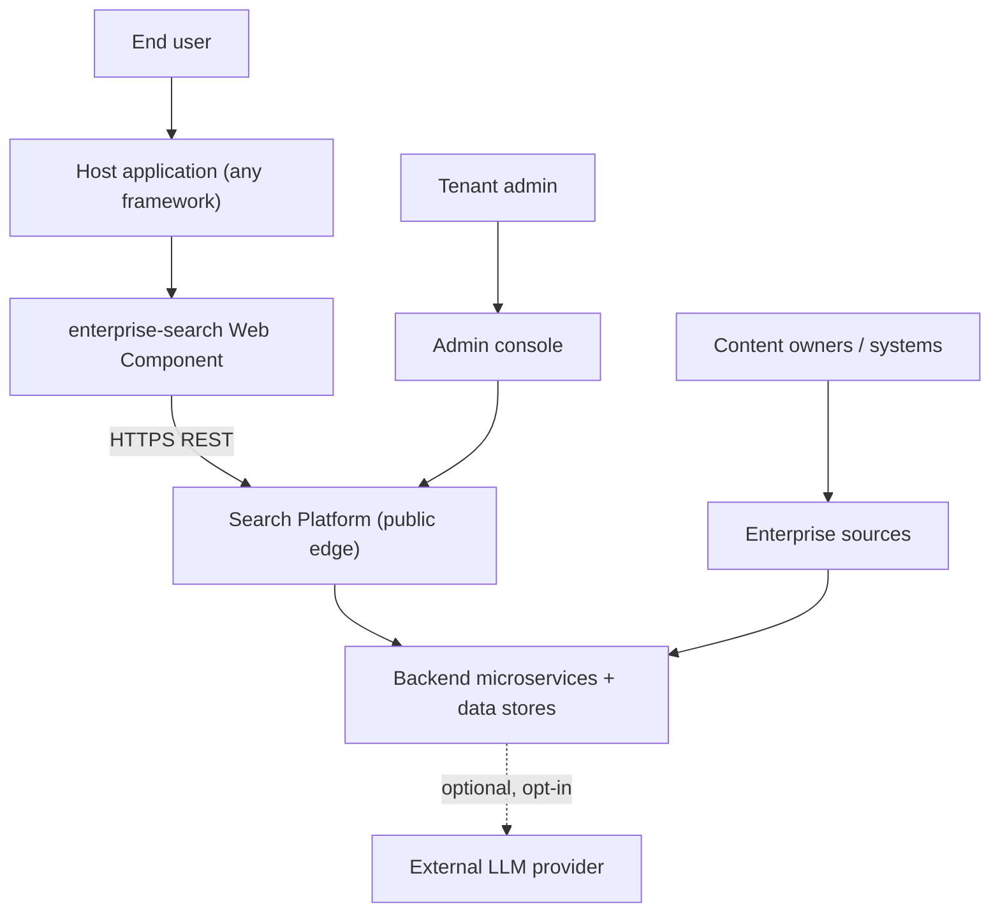
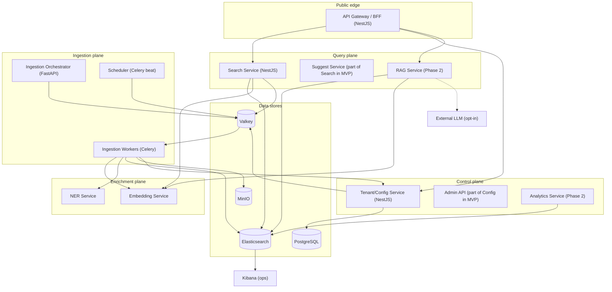
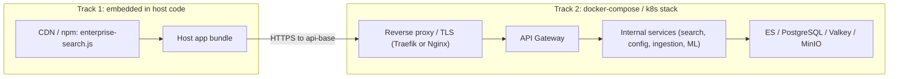
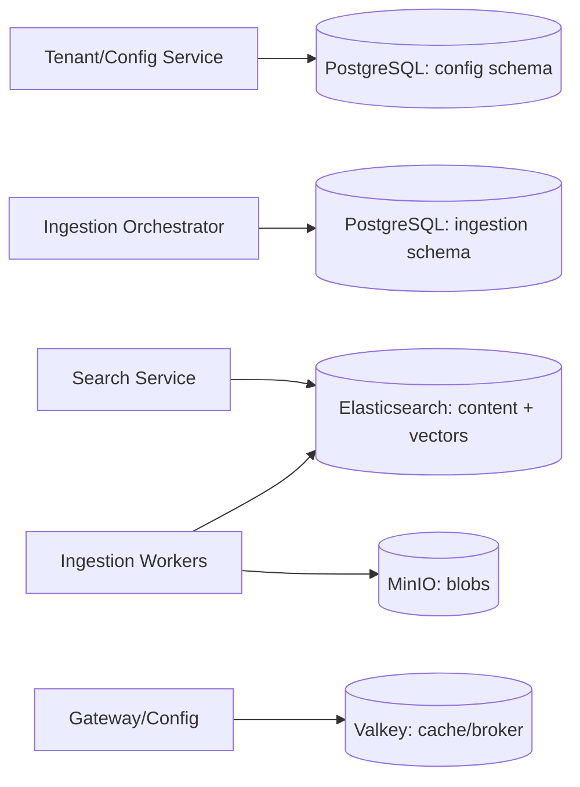
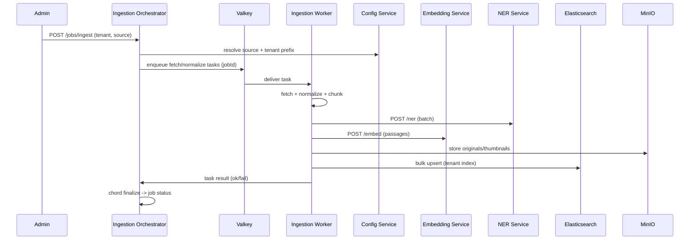
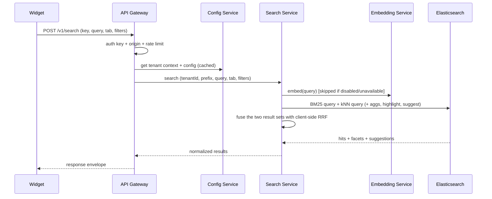
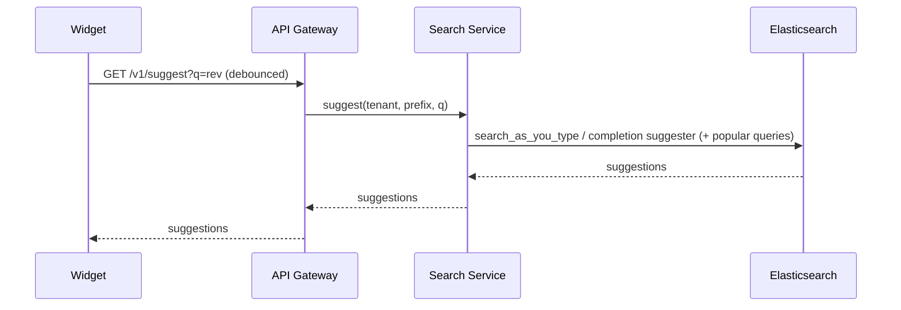
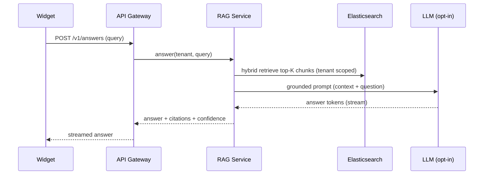
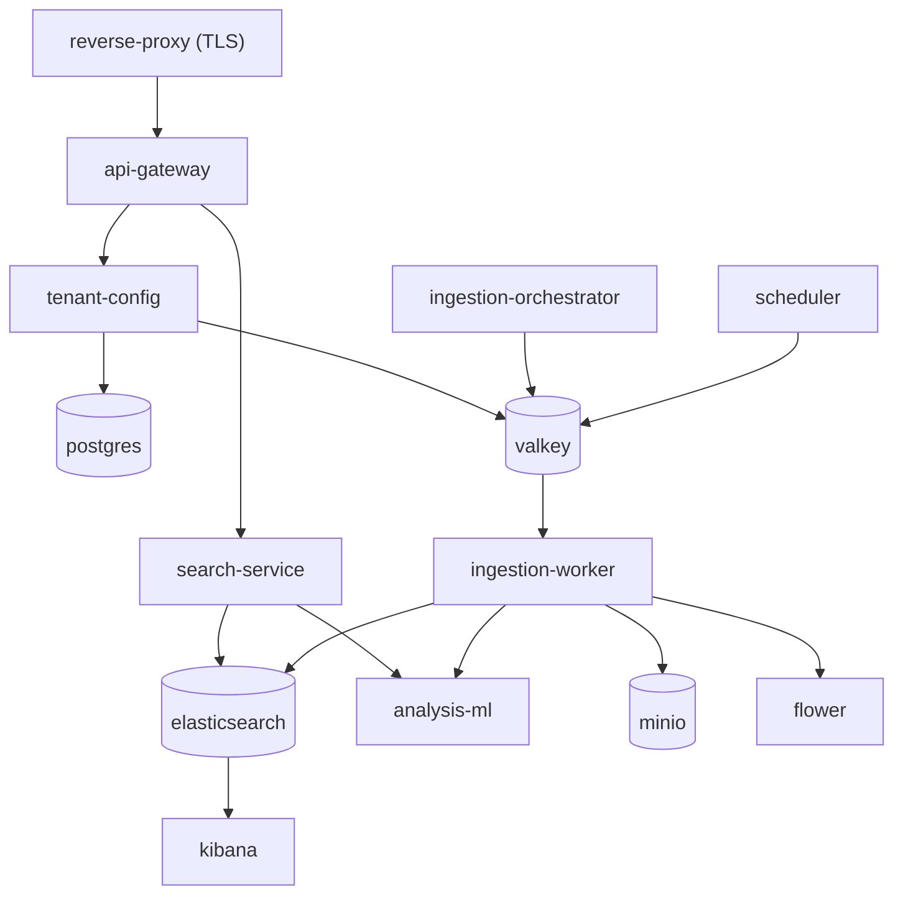
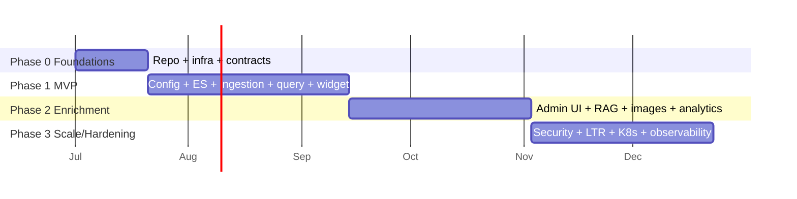

# Enterprise Search Platform - Microservices Blueprint

> A multi-tenant, embeddable enterprise search platform. This document is the single source of truth for the architecture, service design, data model, workflows, deployment, and a phase-by-phase, step-by-step implementation plan. It is a planning/design document only - no code is built from it directly.

| Field | Value |
|---|---|
| Document | Project Plan & Architecture Blueprint |
| Product | Enterprise Search Platform (working name: `Findr`) |
| Style | Microservices, container-first, multi-tenant SaaS |
| Status | Draft v1.0 (planning) |
| Owner | Platform Engineering |
| Related | `.cursor/plans/enterprise_search_platform_5f6cbdc2.plan.md` (short plan) |

---

## Table of contents

1. [Executive summary](#1-executive-summary)
2. [Goals and non-goals](#2-goals-and-non-goals)
3. [Product scope and features](#3-product-scope-and-features)
4. [Microservice architecture principles](#4-microservice-architecture-principles)
5. [System architecture](#5-system-architecture)
6. [Service catalog](#6-service-catalog)
7. [Detailed service specifications](#7-detailed-service-specifications)
8. [Inter-service communication and contracts](#8-inter-service-communication-and-contracts)
9. [Data architecture and multi-tenancy](#9-data-architecture-and-multi-tenancy)
10. [Core workflows](#10-core-workflows)
11. [Search relevance design](#11-search-relevance-design)
12. [Security and compliance](#12-security-and-compliance)
13. [Observability and operations](#13-observability-and-operations)
14. [Deployment and infrastructure](#14-deployment-and-infrastructure)
15. [Repository and monorepo structure](#15-repository-and-monorepo-structure)
16. [Testing strategy and quality gates](#16-testing-strategy-and-quality-gates)
17. [Implementation roadmap](#17-implementation-roadmap)
18. [Feature backlog and future enhancements](#18-feature-backlog-and-future-enhancements)
19. [Risks and mitigations](#19-risks-and-mitigations)
20. [Glossary](#20-glossary)
21. [Appendices](#21-appendices)

---

## 1. Executive summary

The Enterprise Search Platform is a **multi-tenant search-as-a-service** that any application can embed with a single line of code. It provides Google-like search over heterogeneous enterprise content - documents, news, images, and more - with **auto-correction**, **auto-suggestion**, **faceted filtering by tags and metadata**, and **hybrid (keyword + semantic) relevance** powered by Elasticsearch. An optional Retrieval-Augmented Generation (RAG) layer produces cited natural-language answers.

The product ships as two clearly separated deployment tracks:

- **Track 1 - Embeddable micro-frontend.** A framework-agnostic Web Component (`<enterprise-search>`) built from React and distributed as a single JavaScript bundle (npm + CDN). Host applications "deploy" it simply by referencing it in their code. The only backend the host needs to reach is the public API gateway.
- **Track 2 - Backend platform.** A set of containerized microservices orchestrated with Docker Compose (and Kubernetes-ready): API gateway, search service, tenant/config service, ingestion orchestrator, ingestion workers, ML enrichment services, and the data stores (Elasticsearch, PostgreSQL, Valkey, MinIO).

**Multi-tenancy** is a first-class concern: every tenant that integrates the widget gets isolated data via dedicated Elasticsearch indices with a per-tenant prefix and alias, plus a mandatory `tenant_id` filter as defense-in-depth. Everything - enabled tabs, sources, analyzers, synonyms, ranking boosts, widget theming, and rate limits - is **configurable in PostgreSQL**.

This document describes the entire system as a microservice project and lays out a four-phase delivery plan (Phase 0 foundations, Phase 1 MVP, Phase 2 enrichment, Phase 3 scale/hardening) with concrete, ordered steps and acceptance criteria.

---

## 2. Goals and non-goals

### 2.1 Goals

- **Embed anywhere in one line.** A single `<enterprise-search>` custom element works in React, Angular, Vue, Svelte, or plain HTML with full style isolation (shadow DOM).
- **Search across many source types.** Documents, web pages, news, and images ingested into a unified index model, surfaced under Google-like tabs.
- **High relevance out of the box.** Hybrid keyword + vector retrieval fused with Reciprocal Rank Fusion (RRF), plus autosuggest and did-you-mean.
- **Strict multi-tenant isolation.** Data of one tenant is never visible to another.
- **Everything configurable.** Tenants, sources, tabs, analyzers, ranking, theming, and quotas live in a config database and can change without redeploys.
- **Microservice-native.** Independently deployable, independently scalable services with clear contracts, async ingestion, and full observability.
- **Enterprise data privacy.** Embeddings and NER run self-hosted; any external LLM is opt-in per tenant.

### 2.2 Non-goals (for now)

- A general public web crawler (deferred; internal ingestion only in MVP).
- Live federation to third-party search APIs (Bing/Google/News) at query time (roadmap item).
- Full billing/metering platform (usage counters yes; invoicing no).
- Replacing the host application's own identity provider (we consume tenant API keys; end-user SSO/document-level ACLs are Phase 3).

### 2.3 Success metrics

| Metric | Target (MVP) | Target (GA) |
|---|---|---|
| Query p95 latency (cached config) | < 350 ms | < 200 ms |
| Suggest p95 latency | < 120 ms | < 80 ms |
| Search relevance (NDCG@10 vs BM25 baseline) | +10% | +20% |
| Widget bundle size (gzip) | < 120 KB | < 90 KB |
| Ingestion throughput (single worker) | > 200 docs/s (text) | horizontal scale |
| Tenant isolation incidents | 0 | 0 |

### 2.4 Licensing and cost (100% open-source, zero fees)

The platform runs at **zero license cost** on **fully self-hosted, open-source software**. No paid tiers, no SaaS subscriptions, no per-seat fees.

| Component | Project | License | Cost |
|---|---|---|---|
| Search + vectors | Elasticsearch (free Basic tier) | AGPLv3 core (+ SSPL/ELv2) | $0 |
| Config + jobs store | PostgreSQL | PostgreSQL License | $0 |
| Cache + broker | Valkey | BSD-3-Clause | $0 |
| Object storage | MinIO | AGPLv3 | $0 |
| Ops dashboards | Kibana (free Basic) / Grafana | AGPLv3 | $0 |
| Task monitor | Flower | BSD | $0 |
| Gateway/Config/Search | NestJS + Fastify | MIT | $0 |
| Ingestion/ML | FastAPI, Celery, SQLAlchemy | MIT / BSD | $0 |
| Embeddings | sentence-transformers + `bge-small-en-v1.5` | Apache-2.0 / MIT | $0 |
| NER | spaCy + models | MIT | $0 |
| Widget | React, Vite, `@r2wc/react-to-web-component` | MIT | $0 |
| RAG LLM (opt-in) | Mistral / Qwen via Ollama / vLLM / llama.cpp | Apache-2.0 | $0 |
| Reverse proxy | Traefik / Caddy | MIT / Apache-2.0 | $0 |
| Monorepo tooling | pnpm, Turborepo | MIT / MPL-2.0 | $0 |

Two consequences of using the **free Elasticsearch Basic tier** (instead of switching to OpenSearch) are documented wherever relevant:

- **The native RRF retriever is Enterprise-gated** (it returns HTTP 403 on Basic). Hybrid search therefore fuses BM25 + kNN with **client-side RRF** in the Search Service. Vector kNN, BM25, aggregations, suggesters, and TLS/auth/API keys are all included free in Basic.
- **Document-/field-level security and SSO (SAML/OIDC) are not in Basic.** Tenant isolation relies on separate per-tenant indices + a mandatory `tenant_id` filter + least-privilege API keys (all free). Per-user document-level ACLs (Phase 3) are enforced at the **application layer**, not via Elasticsearch native security.

**Container runtime:** on Windows/macOS use **Podman Desktop**, **Rancher Desktop**, or **Docker Engine on WSL2** (all free/OSS) instead of Docker Desktop; the Compose files are identical.

---

## 3. Product scope and features

### 3.1 End-user features (the widget)

- Google-style collapsed search bar that expands into a results surface with tabs: **All**, **Documents**, **News**, **Images** (tabs are tenant-configurable).
- As-you-type **autosuggestion** dropdown.
- **Did you mean?** spelling correction and typo tolerance.
- **Faceted filtering** by tags, metadata fields, entities (from NER), and date ranges, with result counts.
- Result **highlighting/snippets**, pagination / infinite scroll.
- Full **keyboard navigation** and accessibility (WAI-ARIA combobox pattern).
- Optional **Answers** tab (RAG) with cited, generated responses (Phase 2+).
- Per-tenant **theming** and internationalization.

### 3.2 Administrative / platform features

- Tenant onboarding: create tenant, issue API keys, set origin allowlist and rate limits.
- Source management: register connectors (file/JSON upload, local folder, generic REST/DB, later S3/RSS/DB-CDC), schedule jobs.
- Search tuning: synonyms, stopwords, analyzers, ranking boosts, pinned/promoted results.
- Tab and facet configuration per tenant.
- Ingestion job monitoring, retries, dead-letter inspection.
- Search analytics: popular queries, zero-result queries, CTR, latency (Phase 2).

### 3.3 Content/source types (MVP)

| Tab | Source type | Notes |
|---|---|---|
| Documents | `document` | Text/office/PDF-derived text, chunked for RAG |
| News | `news` | Time-ordered articles with `published_at`, source name |
| Images | `image` | Thumbnails in MinIO, OCR text, metadata; visual similarity later |
| All | (union) | Blended results across enabled source types |

---

## 4. Microservice architecture principles

The platform is decomposed into small, independently deployable services organized around **bounded contexts**. We follow these principles:

1. **Single responsibility / bounded context.** Each service owns one clear domain capability (query, config, ingestion orchestration, enrichment, etc.).
2. **Independent deployability and scaling.** Services are containerized and versioned independently; the query path scales separately from the ingestion path.
3. **Database-per-service where it matters.** The config context owns PostgreSQL. The search context owns Elasticsearch (ingestion writes, query reads). Object content lives in MinIO. Services never reach into another service's private store directly - they call APIs or consume events.
4. **Explicit contracts.** All synchronous APIs are documented with OpenAPI; all async messages have versioned schemas. Contracts are stored in `packages/shared-types` and are the integration boundary.
5. **Async by default for heavy work.** Ingestion, enrichment, and reindex are asynchronous jobs on a message broker, so the request path stays fast and resilient.
6. **Stateless request services.** The gateway, search, and enrichment services hold no session state; all state is in the data stores or cache, enabling horizontal scaling.
7. **Resilience patterns.** Timeouts, retries with backoff, circuit breakers, bulkheads, idempotency keys, and dead-letter queues are standard.
8. **Security in depth.** Tenant scoping is enforced at the gateway and re-enforced at the data layer (mandatory `tenant_id` filter + per-tenant index alias).
9. **Observability everywhere.** Structured logs, RED/USE metrics, and distributed tracing across every hop, correlated by a request/tenant id.
10. **Twelve-factor config.** Configuration via environment variables and the config service; no secrets in images; per-environment `.env`.

### 4.1 Why microservices here (trade-offs)

| Benefit | Cost / mitigation |
|---|---|
| Independent scaling of query vs ingestion vs ML | More moving parts -> Compose/K8s orchestration + health checks |
| Polyglot (TypeScript for API, Python for ML/ingest) | Contract drift -> shared schemas + contract tests |
| Fault isolation (a failing connector never breaks search) | Distributed debugging -> tracing + correlation ids |
| Independent release cadence | Operational overhead -> CI/CD templates + IaC |

We deliberately keep the MVP service count modest and split further only where scaling or team boundaries justify it (noted per service in Section 7).

## 5. System architecture

### 5.1 System context (C4 level 1)



### 5.2 Container / service view (C4 level 2)



### 5.3 Deployment topology



Key point: only the **reverse proxy + API gateway** are exposed publicly. All internal services and data stores sit on a private network. The widget is static code shipped with the host; nothing else in Track 1 needs deployment.

### 5.4 Architecture layers summary

| Layer | Services | Runtime | Scaling driver |
|---|---|---|---|
| Presentation | Widget (Web Component), Admin console | Browser | CDN / static |
| Edge | Reverse proxy, API Gateway/BFF | Node | Request QPS |
| Query plane | Search, Suggest, RAG | Node / Python | Search QPS |
| Control plane | Tenant/Config, Admin API, Analytics | Node | Low; cache-heavy |
| Ingestion plane | Ingestion Orchestrator, Workers, Scheduler | Python | Backlog depth |
| Enrichment plane | Embedding, NER | Python (GPU-optional) | Batch volume |
| Data | Elasticsearch, PostgreSQL, Valkey, MinIO | Managed/containers | Data size / IO |

---

## 6. Service catalog

Legend for **Phase**: 1 = MVP, 2 = enrichment, 3 = scale/hardening.

| # | Service | Bounded context | Tech | Sync/Async | Owns data | Phase |
|---|---|---|---|---|---|---|
| S1 | **Widget** (`enterprise-search`) | Presentation | React 18 + Vite + r2wc | Sync (calls gateway) | none (browser state) | 1 |
| S2 | **API Gateway / BFF** | Edge | NestJS (Fastify adapter) | Sync | none (orchestrates) | 1 |
| S3 | **Search Service** | Query | NestJS + `@elastic/elasticsearch` | Sync | reads ES | 1 |
| S4 | **Tenant/Config Service** | Control | NestJS + Prisma | Sync | **PostgreSQL** | 1 |
| S5 | **Ingestion Orchestrator** | Ingestion | FastAPI | Sync API + enqueues async | job metadata (PG) | 1 |
| S6 | **Ingestion Workers** | Ingestion | Celery (Python) | Async (Valkey broker) | writes ES + MinIO | 1 |
| S7 | **Scheduler** | Ingestion | Celery beat | Async | schedules | 1 |
| S8 | **Embedding Service** | Enrichment | FastAPI + sentence-transformers | Sync | none (stateless model) | 1 |
| S9 | **NER Service** | Enrichment | FastAPI + spaCy | Sync | none (stateless model) | 1 |
| S10 | **Admin API** | Control | part of S4 in MVP; split later | Sync | PostgreSQL | 1/2 |
| S11 | **Admin Console** | Presentation | React SPA | Sync | none | 2 |
| S12 | **RAG Service** | Query | FastAPI | Sync + calls LLM | reads ES | 2 |
| S13 | **Analytics Service** | Control | FastAPI + ES | Async ingest + sync read | analytics index (ES) | 2 |
| S14 | **Reranker Service** | Query | FastAPI + cross-encoder | Sync | none | 2/3 |
| I1 | Elasticsearch | Data | Elasticsearch 8.16+ | - | search + vectors | 1 |
| I2 | PostgreSQL | Data | PostgreSQL 16 | - | config/tenant | 1 |
| I3 | Valkey | Data | Valkey 8 (Redis-compatible) | - | cache + broker | 1 |
| I4 | MinIO | Data | MinIO (S3 API) | - | blobs/thumbnails | 1 |
| I5 | Kibana | Ops | Kibana 8.16+ | - | - | 1 |
| I6 | Flower | Ops | Flower | - | - | 1 |

> Note on granularity: In the MVP, `Suggest` lives inside the Search Service, `Admin API` lives inside the Tenant/Config Service, and `Embedding`/`NER` may be packaged as one "Analysis/ML" container exposing `/embed` and `/ner`. They are documented as distinct logical services so they can be split into separate deployables in Phase 2/3 without redesign.

## 7. Detailed service specifications

Every service has a dedicated specification document under [`docs/services/`](docs/services/README.md). Each follows the same template: Purpose and responsibilities, Technology stack, Architecture and position, Interface/API, Data owned/accessed, Dependencies, Configuration, Scaling and performance, Failure modes and resilience, Security, Observability, Local development, Testing, Implementation steps, and Open questions.

| # | Service | Context | Phase | Specification |
|---|---|---|---|---|
| S1 | Search Widget | Presentation | 1 | [widget.md](docs/services/widget.md) |
| S2 | API Gateway / BFF | Edge | 1 | [api-gateway.md](docs/services/api-gateway.md) |
| S3 | Search Service | Query | 1 | [search-service.md](docs/services/search-service.md) |
| S4 | Tenant / Config Service | Control | 1 | [tenant-config-service.md](docs/services/tenant-config-service.md) |
| S5 | Ingestion Orchestrator | Ingestion | 1 | [ingestion-orchestrator.md](docs/services/ingestion-orchestrator.md) |
| S6 | Ingestion Workers | Ingestion | 1 | [ingestion-workers.md](docs/services/ingestion-workers.md) |
| S7 | Scheduler | Ingestion | 1 | [scheduler.md](docs/services/scheduler.md) |
| S8 | Embedding Service | Enrichment | 1 | [embedding-service.md](docs/services/embedding-service.md) |
| S9 | NER Service | Enrichment | 1 | [ner-service.md](docs/services/ner-service.md) |
| S10 | Admin API | Control | 1/2 | [admin-api.md](docs/services/admin-api.md) |
| S11 | Admin Console | Presentation | 2 | [admin-console.md](docs/services/admin-console.md) |
| S12 | RAG Service | Query | 2 | [rag-service.md](docs/services/rag-service.md) |
| S13 | Analytics Service | Control | 2 | [analytics-service.md](docs/services/analytics-service.md) |
| S14 | Reranker Service | Query | 2/3 | [reranker-service.md](docs/services/reranker-service.md) |

Infrastructure components also have dedicated docs: [Elasticsearch](docs/services/elasticsearch.md), [PostgreSQL](docs/services/postgresql.md), [Valkey](docs/services/valkey.md), and [MinIO](docs/services/object-storage-minio.md).

## 8. Inter-service communication and contracts

### 8.1 Communication styles

| Interaction | Style | Protocol | Notes |
|---|---|---|---|
| Widget -> Gateway | Sync | HTTPS/REST | Public; API-key auth |
| Gateway -> Search/Config/RAG | Sync | REST (internal) | Timeouts + circuit breakers |
| Search -> Embedding | Sync | REST | Degrade to BM25 if down |
| Search/RAG -> Elasticsearch | Sync | ES REST | Least-privilege API key |
| Orchestrator -> Workers | Async | Celery over Valkey | Idempotent tasks + DLQ |
| Scheduler -> Workers | Async | Celery over Valkey | Single active beat |
| Workers -> Embedding/NER | Sync | REST | Retries + backoff |
| Config -> consumers | Async | Valkey pub/sub | Cache invalidation |
| Widget -> Gateway (events) | Async (fire-and-forget) | HTTPS beacon | Best-effort analytics |

### 8.2 Contract management

- All synchronous APIs are described with **OpenAPI**; the widget and cross-service clients are generated from these specs.
- Shared TypeScript types and JSON schemas live in `packages/shared-types` and are the single integration boundary.
- Async task and event payloads have **versioned schemas**; consumers tolerate unknown fields (backward-compatible evolution).
- **Contract tests** run in CI: each consumer validates against the provider's published schema to catch drift before deploy.

### 8.3 Resilience patterns (applied consistently)

- Timeouts on every outbound call; retries with exponential backoff + jitter for idempotent operations only.
- Circuit breakers around Search/Embedding/RAG; bulkheads isolate connectors.
- Idempotency keys for ingestion and admin mutations.
- Graceful degradation ladder for search: hybrid -> BM25-only -> cached results -> friendly error.

---

## 9. Data architecture and multi-tenancy

### 9.1 Stores and ownership



Each store has a clear owner (Section 6). No service reaches into another service's private store; access is via APIs or events.

### 9.2 PostgreSQL - config schema (DDL sketch)

```sql
CREATE TABLE config.tenants (
  id           UUID PRIMARY KEY DEFAULT gen_random_uuid(),
  name         TEXT NOT NULL,
  prefix       TEXT NOT NULL UNIQUE,          -- immutable; used in ES index names
  status       TEXT NOT NULL DEFAULT 'active',
  created_at   TIMESTAMPTZ NOT NULL DEFAULT now()
);

CREATE TABLE config.api_keys (
  id                UUID PRIMARY KEY DEFAULT gen_random_uuid(),
  tenant_id         UUID NOT NULL REFERENCES config.tenants(id),
  key_prefix        TEXT NOT NULL,             -- e.g. 'pk_live_acme' for display
  key_hash          TEXT NOT NULL,             -- argon2id hash of the full key
  scopes            TEXT[] NOT NULL DEFAULT '{search}',
  origin_allowlist  TEXT[] NOT NULL DEFAULT '{}',
  rate_limit        INT NOT NULL DEFAULT 60,   -- requests/min
  active            BOOLEAN NOT NULL DEFAULT true,
  created_at        TIMESTAMPTZ NOT NULL DEFAULT now()
);

CREATE TABLE config.sources (
  id                UUID PRIMARY KEY DEFAULT gen_random_uuid(),
  tenant_id         UUID NOT NULL REFERENCES config.tenants(id),
  type              TEXT NOT NULL,             -- document|news|image|rest|db|folder
  name              TEXT NOT NULL,
  connector_config  JSONB NOT NULL DEFAULT '{}',
  schedule          TEXT,                      -- cron or null
  enabled           BOOLEAN NOT NULL DEFAULT true
);

CREATE TABLE config.tab_config (
  id            UUID PRIMARY KEY DEFAULT gen_random_uuid(),
  tenant_id     UUID NOT NULL REFERENCES config.tenants(id),
  tab_key       TEXT NOT NULL,                 -- all|documents|news|images
  label         TEXT NOT NULL,
  source_filter JSONB NOT NULL DEFAULT '{}',
  position      INT NOT NULL DEFAULT 0,
  enabled       BOOLEAN NOT NULL DEFAULT true
);

CREATE TABLE config.search_config (
  tenant_id       UUID PRIMARY KEY REFERENCES config.tenants(id),
  synonyms        JSONB NOT NULL DEFAULT '[]',
  boosts          JSONB NOT NULL DEFAULT '{}',
  facets          JSONB NOT NULL DEFAULT '[]',
  suggest_config  JSONB NOT NULL DEFAULT '{}'
);

CREATE TABLE config.audit_log (
  id          BIGSERIAL PRIMARY KEY,
  tenant_id   UUID,
  actor       TEXT NOT NULL,
  action      TEXT NOT NULL,
  before      JSONB,
  after       JSONB,
  created_at  TIMESTAMPTZ NOT NULL DEFAULT now()
);
```

### 9.3 PostgreSQL - ingestion schema (DDL sketch)

```sql
CREATE TABLE ingestion.jobs (
  id          UUID PRIMARY KEY DEFAULT gen_random_uuid(),
  tenant_id   UUID NOT NULL,
  source_id   UUID,
  type        TEXT NOT NULL,                    -- ingest|reindex|build-suggest|analyze
  status      TEXT NOT NULL DEFAULT 'queued',   -- queued|running|succeeded|partial|failed
  counts      JSONB NOT NULL DEFAULT '{}',      -- {total, ok, failed}
  created_at  TIMESTAMPTZ NOT NULL DEFAULT now(),
  finished_at TIMESTAMPTZ
);

CREATE TABLE ingestion.tasks (
  id          UUID PRIMARY KEY DEFAULT gen_random_uuid(),
  job_id      UUID NOT NULL REFERENCES ingestion.jobs(id),
  kind        TEXT NOT NULL,                    -- fetch|normalize|chunk|enrich|index|thumbnail
  status      TEXT NOT NULL DEFAULT 'queued',
  attempts    INT NOT NULL DEFAULT 0,
  error       TEXT,
  updated_at  TIMESTAMPTZ NOT NULL DEFAULT now()
);

CREATE TABLE ingestion.dead_letter (
  id          UUID PRIMARY KEY DEFAULT gen_random_uuid(),
  task_id     UUID,
  payload     JSONB NOT NULL,
  error       TEXT NOT NULL,
  created_at  TIMESTAMPTZ NOT NULL DEFAULT now()
);
```

### 9.4 Elasticsearch - index model

- Naming: `{tenantPrefix}-{sourceType}-v{N}` (physical) behind alias `{tenantPrefix}-{sourceType}` (read). Chunks: `{tenantPrefix}-chunks-v{N}`. Analytics: `{tenantPrefix}-analytics-{yyyy.MM}` (ILM).
- One index template per source type provides consistent mappings/analyzers.

Core mapping (documents), abridged:

```json
{
  "settings": {
    "analysis": {
      "analyzer": {
        "edge_ngram_analyzer": { "tokenizer": "edge_ngram_tokenizer", "filter": ["lowercase"] }
      },
      "tokenizer": {
        "edge_ngram_tokenizer": { "type": "edge_ngram", "min_gram": 2, "max_gram": 20, "token_chars": ["letter","digit"] }
      }
    }
  },
  "mappings": {
    "properties": {
      "tenant_id":  { "type": "keyword" },
      "source":     { "type": "keyword" },
      "title":      { "type": "text", "fields": { "suggest": { "type": "search_as_you_type" } } },
      "body":       { "type": "text", "copy_to": "content_all" },
      "content_all":{ "type": "text" },
      "url":        { "type": "keyword" },
      "tags":       { "type": "keyword" },
      "metadata":   { "type": "flattened" },
      "entities":   { "type": "keyword" },
      "embedding":  { "type": "dense_vector", "dims": 384, "index": true, "similarity": "cosine" },
      "created_at": { "type": "date" },
      "published_at": { "type": "date" },
      "source_name":  { "type": "keyword" },
      "image_url":    { "type": "keyword" },
      "thumbnail_url":{ "type": "keyword" },
      "ocr_text":     { "type": "text" }
    }
  }
}
```

### 9.5 Multi-tenancy strategy (summary)

1. **Isolation by index + alias** per tenant/source, prefixed by the tenant's immutable `prefix`.
2. **Mandatory `tenant_id` filter** injected into every query as defense-in-depth.
3. **Least-privilege ES API keys** restricted to the tenant index pattern (read for query, write for ingestion).
4. **Config-driven** tenant behavior (tabs, sources, relevance, theming, quotas) from PostgreSQL.
5. **Quotas and rate limits** per API key enforced at the gateway.
6. Roadmap: optional Postgres Row-Level Security and per-user document-level ACLs (Phase 3).

## 10. Core workflows

### 10.1 Ingestion pipeline (end to end)



Steps: resolve config -> plan tasks -> fetch -> normalize to canonical doc -> chunk -> enrich (NER + embeddings) -> store blobs -> bulk index -> finalize with idempotent, retryable tasks (failures -> dead-letter).

### 10.2 Query pipeline (hybrid search)



Hybrid fusion: the free Elasticsearch Basic tier does not include the native RRF retriever, so the Search Service issues the BM25 and kNN queries and fuses them with **client-side RRF**. Degradation: if Embedding is unavailable it runs BM25-only.

### 10.3 Autosuggest flow



### 10.4 Did-you-mean (auto-correction)

- On low result counts or low top score, the Search Service consults the `phrase`/`term` suggester and returns a `didYouMean` string. The widget renders "Did you mean: X" and, optionally, auto-searches the correction when confidence is high.

### 10.5 RAG answer flow (Phase 2)



### 10.6 Tenant onboarding

- Platform admin creates a tenant (allocates `prefix`) -> issues a public search key with an origin allowlist -> registers sources and schedules -> triggers the first ingestion job -> validates results in the admin search preview -> hands the tenant key + snippet to the integrator.

---

## 11. Search relevance design

### 11.1 Hybrid retrieval (RRF)

- Combine a lexical query (BM25 `multi_match` over `title^2, body`) and a semantic query (kNN over `embedding`), fused with Reciprocal Rank Fusion (`rank_constant` 60).
- **Client-side RRF is the default**, because the native `rrf` retriever is gated to Elasticsearch's paid Enterprise tier (HTTP 403 on the free Basic tier). The Search Service runs the two queries in parallel and merges them by rank - RRF needs no score normalization and little tuning.
- RRF fuses by rank, avoiding score-scale mismatches. Weighted RRF (biasing one leg) is trivial to implement client-side. A `HYBRID_MODE` flag lets a licensed cluster switch to the native `rrf` retriever without other changes.

### 11.2 Query understanding

- Analyzers: lowercase, ASCII-folding, stemming, stopwords; per-tenant synonyms; multilingual analyzers later.
- Optional query classification to route short navigational queries to a BM25-heavy blend and long natural-language queries to a vector-heavy blend.

### 11.3 Autosuggest and autocomplete

- `search_as_you_type` on `title` for instant prefix matching; a `completion` suggester seeded with popular queries (from analytics) for high-quality autocomplete; edge n-gram analyzer for partial-token matching.

### 11.4 Did-you-mean / typo tolerance

- `phrase` and `term` suggesters for spelling correction; fuzzy matching (`fuzziness: AUTO`) on lexical clauses; phonetic matching optional.

### 11.5 Faceting and filtering

- Aggregations on `tags`, `entities`, and selected `metadata` fields; date range filters on `created_at`/`published_at`. Facet definitions are per-tenant config; counts returned with results.

### 11.6 Ranking controls (per tenant)

- Field boosts, recency boost (Gaussian decay on date), popularity boost (from click signals, Phase 2), pinned/promoted results (curations), and synonyms - all from `search_config`.

### 11.7 Reranking (Phase 2/3)

- Optional cross-encoder second stage over the top-N fused results, behind a per-tenant flag and latency budget (see [reranker-service.md](docs/services/reranker-service.md)).

### 11.8 Relevance evaluation

- A golden query set with judged results scored via NDCG@10 and MRR in CI. Any ranking change must beat both BM25-only and vector-only baselines before rollout. Online metrics (CTR, zero-result rate) validate offline gains.

## 12. Security and compliance

### 12.1 Authentication and authorization

- **Widget -> Gateway**: public, search-scoped API key + origin allowlist + rate limit. Public keys can only read/search.
- **Admin**: JWT/OIDC with RBAC; MFA at the IdP; separate admin surface not exposed to end users.
- **Service -> service**: internal network + service credentials/mTLS (Phase 3); ES/DB use least-privilege keys/roles.

### 12.2 Tenant isolation (defense in depth)

1. Alias-per-tenant read scoping. 2. Mandatory `tenant_id` filter on every query. 3. Least-privilege ES keys per tenant index pattern. 4. Immutable tenant `prefix`. 5. Per-key quotas. 6. Per-user document-level ACLs enforced at the **application layer** - the free Elasticsearch Basic tier has no native document/field-level security - plus optional Postgres RLS (Phase 3).

All isolation mechanisms above rely only on features included in the free Elasticsearch Basic tier (indices/aliases, query filters, API keys, TLS/auth).

### 12.3 Data protection

- Secrets via environment/secret manager; never in images or VCS.
- TLS in transit; encryption at rest for ES, PostgreSQL, and MinIO in production.
- API keys stored only as argon2id hashes; pre-signed URLs for blobs (no public buckets).
- PII: NER-driven detection and optional redaction before indexing; do not log document bodies or raw queries with PII.

### 12.4 Application security

- Strict input validation; the platform never forwards raw ES DSL from clients (prevents query injection).
- Security headers (helmet), CORS restricted to allowlisted origins, request-size limits.
- Widget uses shadow DOM and sanitized highlight fragments (no unsanitized HTML injection).
- Dependency scanning (SCA), SAST, container image scanning, and secret scanning in CI.

### 12.5 Compliance and governance

- Data retention/ILM policies per tenant; GDPR-style delete (purge tenant/document by id across ES + MinIO + logs).
- Audit logging of all admin mutations. Data residency via regional deployments / cross-cluster (roadmap).

---

## 13. Observability and operations

### 13.1 Three pillars

- **Logs**: structured JSON (pino/structlog), correlated by `x-request-id` and `tenant_id`; no PII in logs.
- **Metrics**: RED (rate, errors, duration) for request services; USE (utilization, saturation, errors) for stores; queue depth for ingestion; relevance metrics (zero-result rate). Exported to Prometheus.
- **Traces**: OpenTelemetry spans across gateway -> search -> embedding/ES and orchestrator -> workers -> enrichment/ES.

### 13.2 Dashboards and alerting

- Grafana dashboards per plane (edge, query, ingestion, enrichment, data).
- Alerts (Alertmanager): p95 latency SLO breaches, error-rate spikes, ES cluster health yellow/red, broker backlog growth, dead-letter accumulation, embedding 429 rate, disk/heap pressure.

### 13.3 Health and readiness

- Every service exposes `/healthz` (liveness) and `/readyz` (dependencies reachable). Compose/K8s use these for restart and traffic gating.

### 13.4 Runbooks (starter set)

- ES cluster red; broker backlog surge; embedding overload; config outage (serve cached); dead-letter replay; blue-green reindex; key compromise (revoke + rotate).

### 13.5 SLOs (initial)

- Search availability 99.9%; query p95 < 350 ms (MVP) / < 200 ms (GA); suggest p95 < 120 ms; ingestion freshness < 5 min for incremental sources.

---

## 14. Deployment and infrastructure

### 14.1 Two deployment tracks

- **Track 1 - Embeddable widget.** Built to a single `enterprise-search.js` (+ an npm package). Published to a CDN/registry. Host apps reference it in code; nothing else to deploy on the host side. Versioned, immutable, cacheable assets.
- **Track 2 - Backend platform.** All microservices + data stores as containers. Local/self-managed via Docker Compose; production via Kubernetes. Only the reverse proxy + API Gateway are publicly exposed.

### 14.2 Docker Compose (MVP)

Services: `reverse-proxy` (Traefik/Nginx, TLS), `api-gateway`, `search-service`, `tenant-config`, `ingestion-orchestrator`, `ingestion-worker`, `scheduler`, `analysis-ml` (embed+ner), `elasticsearch`, `kibana`, `postgres`, `valkey`, `minio`, `flower`. Each with healthchecks, named volumes, a private network, and `.env`-driven config. A `Makefile`/scripts provide `up`, `down`, `seed`, `logs`, `reindex`.

Runtime: the Compose stack runs on any OCI-compatible engine. On Windows/macOS prefer **Podman Desktop**, **Rancher Desktop**, or **Docker Engine on WSL2** (all free/open-source) over Docker Desktop; the Compose files are identical.



### 14.3 Kubernetes (production path)

- Each service is a Deployment with HPA (CPU/latency) or KEDA (queue depth for workers). ES/PostgreSQL via operators or managed services. Valkey via managed/Sentinel. MinIO distributed or managed S3. Ingress + TLS (cert-manager). Config via ConfigMaps/Secrets (or external secret store). Network policies enforce the private/public split.

### 14.4 Environments and CI/CD

- Environments: local (Compose) -> dev -> staging -> production.
- CI: lint, type-check, unit/integration/contract tests, relevance regression, SCA/SAST, image build + scan, publish widget bundle.
- CD: GitOps (Argo CD/Flux) or pipeline deploys; DB migrations gated; canary/blue-green for query services; blue-green reindex for ES mapping changes.
- Turborepo caches builds/tests; only affected packages rebuild.

## 15. Repository and monorepo structure

A single monorepo holds JavaScript/TypeScript apps and services (pnpm workspaces + Turborepo) and Python services (each with its own `pyproject.toml`), plus infrastructure.

```text
enterprise-search/
  apps/
    widget/                 # S1 React -> Web Component (Vite, r2wc)
    admin/                  # S11 Admin Console (Phase 2)
  services/
    api-node/               # S2 API Gateway (NestJS)
    search-service/         # S3 Search (NestJS)
    tenant-config/          # S4 + S10 Config/Admin API (NestJS + Prisma)
    ingestion/              # S5 Orchestrator (FastAPI) + S6 Workers (Celery) + S7 beat
    analysis-ml/            # S8 Embedding + S9 NER (FastAPI)
    rag/                    # S12 RAG (Phase 2)
    analytics/              # S13 Analytics (Phase 2)
    reranker/               # S14 Reranker (Phase 2/3)
  packages/
    shared-types/           # OpenAPI + shared TS types / JSON schemas
    ui-kit/                 # shared widget/admin UI primitives (optional)
    eslint-config/          # shared lint/tsconfig
  infra/
    docker-compose.yml
    elasticsearch/          # index templates, ILM, analyzers
    postgres/               # init scripts, migrations (prisma + alembic)
    minio/                  # bucket bootstrap
    reverse-proxy/          # Traefik/Nginx config
    k8s/                    # Helm charts / manifests (Phase 3)
    seed/                   # demo tenant + sample data
  docs/
    services/               # one spec per service (this set)
    ...
  PROJECT_PLAN.md
  turbo.json
  pnpm-workspace.yaml
  Makefile
  .env.example
```

Conventions: each service has its own `Dockerfile`, `README`, health endpoints, tests, and `.env.example`. Shared contracts change only via `packages/shared-types` with a version bump and contract tests.

---

## 16. Testing strategy and quality gates

### 16.1 Test pyramid

| Level | Scope | Tooling |
|---|---|---|
| Unit | Pure logic (query builder, auth guards, parsers, prompt assembly) | Vitest/Jest, Pytest |
| Integration | Service + real dependency in a container | Testcontainers (ES, PG, Valkey, MinIO) |
| Contract | Provider/consumer schema conformance | OpenAPI + schema validation in CI |
| E2E | User journeys (search, suggest, onboarding) | Playwright (widget + admin) |
| Relevance | Ranking quality vs baselines | Golden set + NDCG/MRR harness |
| Load/perf | Latency + throughput SLOs | k6 (query), custom (ingestion) |
| Security | SCA/SAST/secret/image scans | CI scanners |

### 16.2 Key quality gates (CI must pass)

- Lint + type-check across all packages.
- Unit + integration tests for changed services (Turbo affected graph).
- Contract tests green (no unversioned breaking changes).
- Relevance regression: hybrid beats BM25-only and vector-only on the golden set.
- Widget bundle size within budget; accessibility (axe) checks pass.
- No high/critical vulnerabilities; no secrets committed.

### 16.3 Test data and environments

- Seed scripts create a deterministic demo tenant with documents/news/images for reproducible tests and demos.
- Ephemeral, containerized dependencies per test run; no shared mutable state.

## 17. Implementation roadmap

Four phases from empty repository to a hardened, scalable platform. Each phase lists epics broken into ordered, concrete steps with deliverables and acceptance criteria. Steps within a phase are largely sequential; independent tracks (e.g., widget vs backend) can proceed in parallel.



### 17.1 Phase 0 - Foundations

Objective: a running skeleton - monorepo, containerized infrastructure, contracts, and CI - so feature work starts on solid ground.

- **Epic 0.1 Monorepo and tooling**
  1. Initialize the repo, `pnpm-workspace.yaml`, `turbo.json`, shared `eslint-config`/`tsconfig`, `.editorconfig`, `.gitignore`.
  2. Create the `apps/`, `services/`, `packages/`, `infra/`, `docs/` skeletons with placeholder READMEs.
  3. Set up `packages/shared-types` with the initial OpenAPI stubs for `/v1/*`.
- **Epic 0.2 Infrastructure via Compose**
  4. Author `infra/docker-compose.yml` with Elasticsearch, Kibana, PostgreSQL, Valkey, MinIO, Flower, and a reverse proxy, all with healthchecks, volumes, and a private network.
  5. Add `.env.example` and a `Makefile` (`up/down/seed/logs`).
  6. Enable ES security; script per-service ES API keys; bootstrap MinIO buckets; init PostgreSQL schemas/roles.
- **Epic 0.3 CI/CD baseline**
  7. CI pipeline: install, lint, type-check, unit test, build; Turbo remote cache.
  8. Add SCA/secret scanning and image build jobs.

Deliverables: bootable infra stack; empty-but-wired monorepo; green CI.
Acceptance: `make up` brings all infra healthy; `make down` cleans up; CI passes on an empty PR.
Exit criteria: every developer can run the stack locally and open Kibana/Flower/MinIO consoles.

### 17.2 Phase 1 - MVP

Objective: ingest a demo tenant's documents/news/images and search them (hybrid + suggest + did-you-mean + facets) through the embeddable widget, fully tenant-scoped, via one `docker compose up`.

- **Epic 1.1 Tenant/Config Service (S4)**
  1. Prisma schema + migration for `config.*` tables; per-service DB role.
  2. API-key issuance/verification (argon2id) + origin allowlist storage.
  3. Read APIs + aggregated `/config`; publish Valkey invalidation events.
  4. Minimal admin write APIs (behind an admin key).
  5. Seed script: demo tenant, source, tabs, search-config, public key.
- **Epic 1.2 Elasticsearch design**
  6. Index templates (mappings + analyzers) for documents/news/images + the alias convention.
  7. Provision read/write ES keys scoped to the tenant index pattern.
- **Epic 1.3 Enrichment services (S8/S9)**
  8. `analysis-ml` FastAPI: `/embed` (bge-small, query/passage prefixes, batching) + `/model` + `/healthz`.
  9. `/ner` (spaCy) with batching and type filtering; containerize with models pre-pulled.
- **Epic 1.4 Ingestion (S5/S6/S7)**
  10. Orchestrator FastAPI: `ingestion` schema (Alembic), `/jobs/ingest`, `/jobs/{id}`, `/documents:bulk`.
  11. Connector interface + MVP connectors: file/JSON upload, local folder, generic REST/DB.
  12. Worker pipeline: normalize -> chunk -> enrich (S8/S9) -> thumbnail (MinIO) -> bulk index; chords finalize jobs.
  13. Retry/backoff, dead-letter routing, per-queue workers; Flower wired.
  14. Beat scheduler with DB-backed schedules + leader lock.
- **Epic 1.5 Search Service (S3)**
  15. Tenant/tab -> alias resolution + mandatory `tenant_id` filter.
  16. Query builder: multi_match + kNN with client-side RRF fusion, facets, highlighting.
  17. Suggest (`search_as_you_type`) + did-you-mean (`phrase`/`term` + fuzzy).
  18. Client-side RRF fusion (default) + BM25-only degradation; query embedding via S8 with caching.
  19. Relevance regression harness (golden set, NDCG/MRR).
- **Epic 1.6 API Gateway (S2)**
  20. NestJS + Fastify with health/metrics; API-key auth guard (cached verify).
  21. Origin allowlist + CORS + Valkey-backed rate limiting.
  22. DTO validation; BFF mapping to Search/Config; response envelope; OpenTelemetry + logs.
- **Epic 1.7 Widget (S1)**
  23. Vite + React app: search box, suggestions, tabbed results, facet panel, did-you-mean line, highlighting, pagination.
  24. TanStack Query hooks (config/search/suggest/autocomplete) with debounce/cancellation; theming via CSS variables; a11y (combobox pattern).
- **Epic 1.8 Widget distribution (widget-dist)**
  25. Wrap with `@r2wc/react-to-web-component`; define `enterprise-search`; wire props/events + shadow DOM.
  26. Vite multi-entry build -> single `enterprise-search.js`; publishable npm package; demo host pages (HTML/React/Vue).
- **Epic 1.9 End-to-end demo**
  27. Seed demo data; run the full stack; verify tenant-scoped hybrid search + suggest + filters across All/Documents/News/Images.
  28. Verify isolation: a second tenant cannot see the first's data.

Deliverables: working platform + embeddable widget + seeded demo.
Acceptance: from a clean checkout, `make up && make seed` yields a widget that searches the demo tenant across all tabs with suggest/did-you-mean/facets; isolation verified; query p95 < 350 ms locally; relevance harness shows hybrid >= baselines.
Exit criteria: a host page embeds `<enterprise-search>` and searches successfully against the gateway.

### 17.3 Phase 2 - Enrichment and configuration

Objective: make the platform self-serviceable and richer - admin UI, more connectors, images, RAG answers, and analytics.

- **Epic 2.1 Admin API + Console (S10/S11)**: OIDC + RBAC + audit; React console for sources/jobs, tabs/facets, relevance tuning with live preview, key management, theming preview.
- **Epic 2.2 More connectors**: S3/MinIO, RSS/news, database/CDC, Confluence/SharePoint-style; incremental/delta sync + deletion propagation.
- **Epic 2.3 Image search**: thumbnails pipeline, OCR text, EXIF metadata; optional CLIP embeddings for visual similarity ("search by image").
- **Epic 2.4 Relevance tuning**: per-tenant synonyms/analyzers/boosts, pinned/promoted results (curations), recency/popularity boosts.
- **Epic 2.5 RAG (S12)**: chunk retrieval, pluggable LLM (self-hosted first), grounded prompts with citations, caching/budgets/streaming, widget Answers tab.
- **Epic 2.6 Reranking (S14)**: cross-encoder second stage behind a per-tenant flag + latency budget.
- **Epic 2.7 Analytics (S13)**: event intake, reports (top/zero-result/CTR/latency), feed popular queries into suggestions; dashboards in the console.

Deliverables: admin self-service, richer sources/relevance, optional generative answers, analytics.
Acceptance: an admin can onboard a tenant and tune relevance without engineering; RAG returns cited answers on demo data; analytics dashboards populate; reranking shows measurable NDCG uplift where enabled.

### 17.4 Phase 3 - Scale and hardening

Objective: enterprise-grade security, scale, and operability.

- **Epic 3.1 Security hardening**: SSO/OIDC everywhere, per-tenant RBAC, document-level ACL filtering, Postgres RLS, PII detection/redaction, field-level encryption, full audit.
- **Epic 3.2 Relevance at scale**: learning-to-rank with click signals, personalization, query classification routing, A/B ranking experiments.
- **Epic 3.3 Data lifecycle**: ES ILM + snapshots + tested restores, blue-green reindex automation, retention/GDPR delete tooling.
- **Epic 3.4 Kubernetes + autoscaling**: Helm charts, HPA/KEDA (queue-depth workers), operators/managed data services, network policies, cert-manager.
- **Epic 3.5 Observability + SLOs**: full OpenTelemetry, Grafana dashboards, Alertmanager, runbooks, error budgets; usage metering/quotas for billing.
- **Epic 3.6 Multi-region / residency (optional)**: cross-cluster search, regional deployments.

Deliverables: production-ready, secure, autoscaling platform with SLOs and metering.
Acceptance: passes a security review; sustains target QPS with autoscaling in a load test; DR restore drill succeeds; SLO dashboards and alerts operational.

## 18. Feature backlog and future enhancements

- **Query understanding**: multilingual analyzers, phonetic matching, spell-correction tuning, query classification/routing, entity-aware queries.
- **Relevance**: learning-to-rank, semantic reranking, pinned/promoted curations, recency/popularity boosts, per-query-class blends.
- **UX**: RAG answers with streaming + citations, search-by-image, recent/saved searches, search alerts (notify on new matches), rich previews, per-tenant theming/i18n/a11y.
- **Content**: more connectors (S3/GCS, RSS, DB/CDC, Confluence/SharePoint, Slack, email), dedup/canonicalization, incremental sync + tombstones, optional web crawler.
- **Governance/security**: document-level ACLs, PII detection/redaction, field-level encryption, GDPR delete/retention, audit, data residency.
- **Ops/scale**: query/suggest caching tiers, KEDA autoscaling, ILM + snapshots, blue-green reindex, tracing, SLO dashboards, per-tenant quotas + usage metering/billing.
- **Integration**: headless JS SDK + REST alongside the widget, event hooks for host analytics, webhooks for ingestion status, GraphQL BFF option.
- **Federation**: live third-party search APIs (Bing/Google/News) blended at query time (opt-in).

## 19. Risks and mitigations

| Risk | Impact | Likelihood | Mitigation |
|---|---|---|---|
| Cross-tenant data leak | Critical | Low | Alias scoping + mandatory `tenant_id` filter + least-privilege keys + isolation tests |
| ES Basic lacks native RRF + doc/field-level security | Medium | High | Client-side RRF (default); tenant isolation via per-tenant index + mandatory filter; per-user ACLs at app layer |
| Embedding latency inflates query time | Medium | Medium | Cache query vectors, degrade to BM25, batch, GPU option |
| Ingestion backlog / poison messages | Medium | Medium | Per-queue workers, backpressure, retries + dead-letter, autoscaling |
| Model/data privacy concerns | High | Medium | Self-hosted embeddings/NER; LLM opt-in per tenant |
| Widget bundle bloat | Medium | Medium | Bundle budget, code-split, tree-shake, measure in CI |
| Operational complexity of many services | Medium | High | Compose for local, Helm + operators for prod, strong observability, runbooks |
| Relevance regressions on tuning | Medium | Medium | Golden-set NDCG/MRR gate + online CTR monitoring |
| Contract drift between polyglot services | Medium | Medium | Shared schemas + contract tests in CI |
| Cost of LLM/RAG | Medium | Medium | Answer caching, budgets, self-hosted models, per-tenant flags |

## 20. Glossary

- **BM25**: Lexical relevance scoring (keyword match).
- **kNN / dense_vector**: Approximate nearest-neighbor vector search over embeddings.
- **RRF**: Reciprocal Rank Fusion - merges ranked lists by rank position.
- **Hybrid search**: Combining lexical (BM25) and semantic (vector) retrieval.
- **Embedding**: A numeric vector representation of text used for semantic search.
- **NER**: Named Entity Recognition (people, orgs, locations, etc.).
- **RAG**: Retrieval-Augmented Generation - grounding an LLM answer in retrieved content.
- **Alias**: An ES pointer to one or more physical indices, enabling zero-downtime swaps.
- **Prefix**: A tenant's immutable namespace used in index names for isolation.
- **BFF**: Backend-for-Frontend - an API tailored to a specific client (the widget).
- **Web Component / custom element**: A framework-agnostic, reusable HTML element.
- **Shadow DOM**: Encapsulated DOM/CSS subtree isolating the widget from host styles.
- **DLQ**: Dead-Letter Queue for messages/tasks that repeatedly fail.
- **ILM**: Index Lifecycle Management (rollover/retention of time-based indices).
- **LTR**: Learning-to-Rank - ML-trained ranking from relevance signals.

## 21. Appendices

### 21.1 Environment variables (representative)

- **Gateway**: `PORT`, `REDIS_URL`, `CONFIG_SERVICE_URL`, `SEARCH_SERVICE_URL`, `RAG_SERVICE_URL`, `RATE_LIMIT_DEFAULT`, `CORS_STRICT`, `CONFIG_CACHE_TTL_SECONDS`, `OTEL_EXPORTER_OTLP_ENDPOINT`.
- **Search**: `ELASTICSEARCH_URL`, `ELASTICSEARCH_API_KEY`, `EMBEDDING_SERVICE_URL`, `REDIS_URL`, `RRF_RANK_CONSTANT`, `RRF_RANK_WINDOW`, `KNN_K`, `KNN_NUM_CANDIDATES`, `HYBRID_MODE`, `MAX_PAGE_SIZE`.
- **Config**: `DATABASE_URL`, `REDIS_URL`, `API_KEY_HASH_ALGO`, `ADMIN_JWT_ISSUER`, `CONFIG_EVENT_CHANNEL`.
- **Ingestion**: `DATABASE_URL`, `CELERY_BROKER_URL`, `CELERY_RESULT_BACKEND`, `CONFIG_SERVICE_URL`, `DEFAULT_CHUNK_SIZE`, `DEFAULT_CHUNK_OVERLAP`.
- **Workers**: `ELASTICSEARCH_URL`, `EMBEDDING_SERVICE_URL`, `NER_SERVICE_URL`, `MINIO_ENDPOINT`, `MINIO_ACCESS_KEY`, `MINIO_SECRET_KEY`, `WORKER_CONCURRENCY`, `BULK_BATCH_SIZE`, `MAX_RETRIES`.
- **Embedding**: `EMBEDDING_MODEL`, `EMBEDDING_DIM`, `MAX_BATCH_SIZE`, `NORMALIZE`, `DEVICE`, `BACKEND`.
- **NER**: `SPACY_MODEL`, `USE_TRANSFORMER`, `MAX_BATCH_SIZE`, `DEVICE`.

### 21.2 Widget embed snippet

```html
<script type="module" src="https://cdn.acme.com/enterprise-search.js"></script>
<enterprise-search
  tenant-key="pk_live_acme_xxx"
  api-base="https://search.acme.com"
  locale="en">
</enterprise-search>
```

Custom-element registration (build side):

```js
import r2wc from "@r2wc/react-to-web-component";
import SearchApp from "./SearchApp";

customElements.define("enterprise-search", r2wc(SearchApp, {
  props: { tenantKey: "string", apiBase: "string", theme: "json", tabs: "json", locale: "string" },
  events: { onSearch: {}, onResultClick: {}, onSuggestSelect: {}, onTabChange: {} },
  shadow: "open",
}));
```

### 21.3 Sample hybrid query (client-side RRF on free Elasticsearch)

Because the native `rrf` retriever is Enterprise-gated, the Search Service runs two independent queries and fuses them by rank.

Query 1 - BM25 (lexical), with facets and highlighting:

```json
GET acme-documents/_search
{
  "query": { "bool": {
    "must": [{ "multi_match": { "query": "quarterly revenue", "fields": ["title^2","body"] } }],
    "filter": [{ "term": { "tenant_id": "acme" } }]
  } },
  "highlight": { "fields": { "body": {} } },
  "aggs": { "tags": { "terms": { "field": "tags", "size": 20 } } }
}
```

Query 2 - kNN (semantic), vector from the Embedding Service:

```json
GET acme-documents/_search
{
  "knn": {
    "field": "embedding",
    "query_vector": [ /* 384 floats */ ],
    "k": 50, "num_candidates": 200,
    "filter": [{ "term": { "tenant_id": "acme" } }]
  }
}
```

Fusion in the Search Service: `score(doc) = Σ 1 / (rank_constant + rank_in_list)` with `rank_constant = 60`, summed across both lists, then sort by fused score. (On a licensed cluster the two calls collapse into one `retriever.rrf` request.)

### 21.4 Connector interface (contract)

```python
class Connector(Protocol):
    def validate(self, config: dict) -> None: ...
    def fetch(self, config: dict, cursor: str | None) -> Iterator[RawRecord]: ...
    def to_canonical(self, record: RawRecord) -> CanonicalDoc: ...
    # cursor enables incremental/delta sync; None means full crawl
```

### 21.5 Document set map

- Master blueprint (this file): [`PROJECT_PLAN.md`](PROJECT_PLAN.md).
- Service specifications: [`docs/services/`](docs/services/README.md) - one file per service (S1-S14) and per infrastructure component (I1-I4).
- Short internal plan (pre-existing): `.cursor/plans/enterprise_search_platform_5f6cbdc2.plan.md`.

---

_End of blueprint. This is a planning document; implementation happens in a later, separate step._


