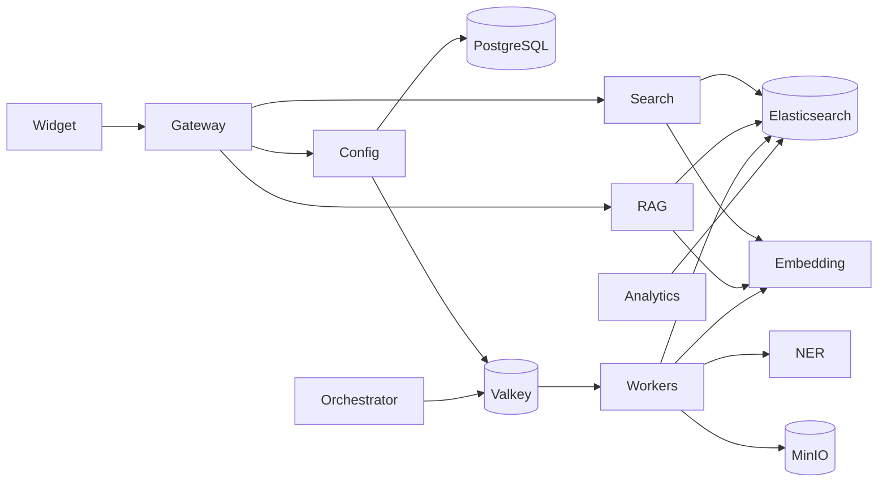

# Service Documentation Index

Each microservice in the Enterprise Search Platform has its own specification document. Every document follows the same template so services are easy to compare and onboard.

For the overall architecture, data model, workflows, deployment, and phased roadmap, see the master blueprint: [`../../PROJECT_PLAN.md`](../../PROJECT_PLAN.md).

## Per-service template

Every service doc contains: Purpose & responsibilities, Technology stack, Architecture & position, Interface/API, Data owned/accessed, Dependencies, Configuration (env), Scaling & performance, Failure modes & resilience, Security, Observability, Local development, Testing, Implementation steps, and Open questions.

## Application services

| # | Service | Context | Tech | Phase | Doc |
|---|---|---|---|---|---|
| S1 | Search Widget | Presentation | React + Vite + r2wc | 1 | [widget.md](widget.md) |
| S2 | API Gateway / BFF | Edge | NestJS | 1 | [api-gateway.md](api-gateway.md) |
| S3 | Search Service | Query | NestJS + ES client | 1 | [search-service.md](search-service.md) |
| S4 | Tenant / Config Service | Control | NestJS + Prisma | 1 | [tenant-config-service.md](tenant-config-service.md) |
| S5 | Ingestion Orchestrator | Ingestion | FastAPI | 1 | [ingestion-orchestrator.md](ingestion-orchestrator.md) |
| S6 | Ingestion Workers | Ingestion | Celery | 1 | [ingestion-workers.md](ingestion-workers.md) |
| S7 | Scheduler | Ingestion | Celery beat | 1 | [scheduler.md](scheduler.md) |
| S8 | Embedding Service | Enrichment | FastAPI + sentence-transformers | 1 | [embedding-service.md](embedding-service.md) |
| S9 | NER Service | Enrichment | FastAPI + spaCy | 1 | [ner-service.md](ner-service.md) |
| S10 | Admin API | Control | NestJS | 1/2 | [admin-api.md](admin-api.md) |
| S11 | Admin Console | Presentation | React SPA | 2 | [admin-console.md](admin-console.md) |
| S12 | RAG Service | Query | FastAPI + self-hosted LLM | 2 | [rag-service.md](rag-service.md) |
| S13 | Analytics Service | Control | FastAPI + ES | 2 | [analytics-service.md](analytics-service.md) |
| S14 | Reranker Service | Query | FastAPI + cross-encoder | 2/3 | [reranker-service.md](reranker-service.md) |

## Infrastructure components

| # | Component | Role | Doc |
|---|---|---|---|
| I1 | Elasticsearch | Search + vector store | [elasticsearch.md](elasticsearch.md) |
| I2 | PostgreSQL | Config/tenant + job metadata | [postgresql.md](postgresql.md) |
| I3 | Valkey | Cache + broker + rate limit | [valkey.md](valkey.md) |
| I4 | MinIO | Object storage (blobs/thumbnails) | [object-storage-minio.md](object-storage-minio.md) |

## Dependency overview

