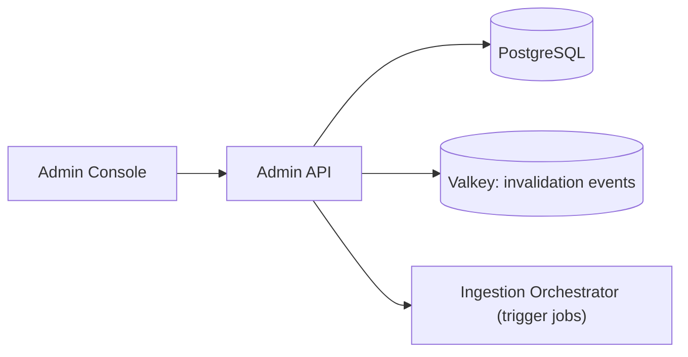

# S10 - Admin API

> Authenticated write surface for tenant onboarding, key management, source registration, and relevance tuning. Control context. Phase 1 (as part of S4) -> Phase 2 (own deployable).

## 1. Purpose and responsibilities

- Provide the administrative operations that mutate configuration: create tenants, issue/revoke API keys, register sources and schedules, configure tabs/facets, and tune relevance (synonyms, boosts, pinned results).
- Enforce role-based access control (RBAC) and write an audit trail.
- In the MVP this is the write side of the Tenant/Config Service; it is extracted into its own deployable when admin traffic and permission boundaries justify it.

## 2. Technology stack

- NestJS + TypeScript, Prisma, PostgreSQL.
- JWT/OIDC for admin identity; RBAC guards; request auditing middleware.

## 3. Architecture and position

## 4. Interface (admin REST, auth required)

| Method | Path | Purpose |
|---|---|---|
| POST | `/admin/tenants` | Create tenant (allocate prefix) |
| POST | `/admin/tenants/:id/keys` | Issue key (public/admin scope) |
| DELETE | `/admin/keys/:id` | Revoke key |
| POST | `/admin/tenants/:id/sources` | Register a source/connector + schedule |
| POST | `/admin/tenants/:id/sources/:sid/run` | Trigger an ingestion job |
| PUT | `/admin/tenants/:id/tabs` | Configure tabs/facets |
| PUT | `/admin/tenants/:id/search-config` | Synonyms, boosts, pinned results |
| GET | `/admin/tenants/:id/jobs` | Job status (proxied) |
| GET | `/admin/audit` | Audit log query |

## 5. Data owned / accessed

- Writes the config schema (via the Config domain). Reads job status from the Orchestrator. Emits invalidation events.

## 6. Dependencies

- PostgreSQL, Valkey, Ingestion Orchestrator, Identity provider (OIDC).

## 7. Configuration (env)

`PORT`, `DATABASE_URL`, `REDIS_URL`, `OIDC_ISSUER`, `OIDC_AUDIENCE`, `RBAC_ROLES`, `AUDIT_RETENTION_DAYS`.

## 8. Scaling and performance

- Low traffic; a small replica count. Protect against accidental bulk mutations with confirmations and rate limits.

## 9. Failure modes and resilience

- All writes are transactional and audited; config changes publish invalidation events.
- Key operations are idempotent where possible; revocation is immediate (event) + TTL-backed.

## 10. Security considerations

- Strong admin auth (OIDC + MFA at the IdP), RBAC per action, full audit trail.
- Separation from the public gateway; admin surface is not internet-exposed to end users.
- Prefix immutability and validation to protect tenant isolation.

## 11. Observability

- Metrics: admin action counts by type/role, failures, audit volume.
- Every mutation logged with actor, before/after, and correlation id.

## 12. Local development

- Seed an admin user/role; use a local OIDC (e.g., Keycloak) or a dev JWT signer.

## 13. Testing

- Unit: RBAC guards, validation, audit writing.
- Integration: full onboarding flow (tenant -> key -> source -> run job) against ephemeral PG.

## 14. Implementation steps

1. (Phase 1) Implement admin write endpoints inside the Tenant/Config Service with a simple admin key/JWT.
2. (Phase 2) Extract into a standalone Admin API; add OIDC + RBAC + audit.
3. Wire source-run to the Ingestion Orchestrator.
4. Add config draft/publish and change history.

## 15. Open questions / future work

- Fine-grained RBAC (per-tenant admins vs platform admins).
- Approval workflows for relevance changes.
- Self-serve onboarding and billing hooks.
