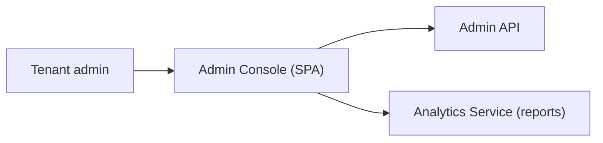

# S11 - Admin Console

> The web UI for tenant administrators to manage sources, tabs, relevance, jobs, and analytics. Presentation context. Phase 2.

## 1. Purpose and responsibilities

- Give tenant admins a GUI over the Admin API: onboard/manage tenants (platform admins), issue keys, register/monitor sources and jobs, configure tabs/facets, tune relevance (synonyms/boosts/pinned results), preview widget theming, and view search analytics.

## 2. Technology stack

- React SPA (Vite) + TypeScript, a component library (e.g., a headless UI + design tokens), TanStack Query, charts for analytics.
- Auth via OIDC (PKCE) against the platform IdP.

## 3. Architecture and position

## 4. Interface

- No backend of its own; it is a client of the Admin API and Analytics Service. Key screens:
  - Sources & Jobs (register, schedule, run, monitor, dead-letter replay).
  - Tabs & Facets configuration.
  - Relevance tuning (synonyms, boosts, pinned/promoted results) with a live search preview.
  - Widget theming preview.
  - API keys & origin allowlist management.
  - Analytics dashboards (top/zero-result queries, CTR, latency).

## 5. Data owned / accessed

- None persisted client-side beyond session tokens (in memory) and UI preferences.

## 6. Dependencies

- Admin API, Analytics Service, IdP (OIDC).

## 7. Configuration

- Build/runtime: `ADMIN_API_BASE`, `OIDC_CLIENT_ID`, `OIDC_ISSUER`, feature flags.

## 8. Scaling and performance

- Static SPA served via CDN; scales trivially.

## 9. Failure modes and resilience

- Graceful error and empty states; optimistic UI with rollback on API failure; token refresh handling.

## 10. Security considerations

- OIDC PKCE, short-lived tokens, no admin secrets in the browser, CSP, RBAC-aware UI (hide/disable unauthorized actions - server still enforces).

## 11. Observability

- Frontend error/telemetry reporting; audit is authoritative server-side.

## 12. Local development

- `pnpm --filter admin dev` against a local Admin API and dev OIDC.

## 13. Testing

- Unit: components and forms. E2E: onboarding and relevance-tuning flows (Playwright). Accessibility checks.

## 14. Implementation steps (Phase 2)

1. Scaffold `apps/admin` (Vite + React + OIDC).
2. Build Sources/Jobs, Tabs/Facets, Relevance, Keys, and Analytics screens.
3. Add the live search preview using a scoped admin key.
4. E2E tests for the critical admin journeys.

## 15. Open questions / future work

- Multi-workspace / org hierarchy.
- Role-based dashboards; scheduled reports.
- In-app onboarding wizard.
