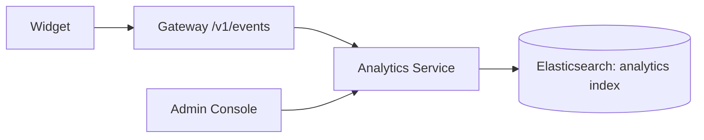

# S13 - Analytics Service

> Captures search behavior and serves aggregates that drive tuning and suggestions. Control context. Phase 2.

## 1. Purpose and responsibilities

- Ingest client events (impressions, clicks, zero-result) and query logs.
- Store them in a dedicated analytics index and serve aggregates: top queries, zero-result rate, click-through rate (CTR), latency histograms, per-tab usage.
- Feed suggestion rebuilds (popular queries) and relevance tuning.

## 2. Technology stack

- FastAPI (Python) with an async event intake, buffered/batched writes to Elasticsearch (analytics index). Optional Kafka/Valkey Streams buffer at scale.

## 3. Architecture and position

## 4. Interface (internal REST)

| Method | Path | Purpose |
|---|---|---|
| POST | `/events` | Accept a batch of client/query events |
| GET | `/reports/top-queries` | Most frequent queries |
| GET | `/reports/zero-results` | Queries returning nothing |
| GET | `/reports/ctr` | Click-through by query/tab |
| GET | `/reports/latency` | Latency percentiles |

## 5. Data owned / accessed

- Owns per-tenant analytics indices (`{prefix}-analytics-*`, time-based with ILM). Read-only to content indices.

## 6. Dependencies

- Elasticsearch, Gateway (event source), Config Service (tenant scoping).

## 7. Configuration (env)

`PORT`, `ELASTICSEARCH_URL`, `EVENT_BUFFER_SIZE`, `FLUSH_INTERVAL_MS`, `ANALYTICS_ILM_DAYS`, `SAMPLING_RATE`.

## 8. Scaling and performance

- Buffer + bulk write to protect ES; sample high-volume event types if needed.
- Reports use pre-aggregations / transforms for speed.

## 9. Failure modes and resilience

- Event intake is best-effort and must never block search; drop/sample under pressure.
- Buffer to disk/stream if ES is temporarily unavailable.

## 10. Security considerations

- Store query text with care (may contain PII); support hashing/redaction and per-tenant retention.
- Reports scoped strictly to the requesting tenant.

## 11. Observability

- Metrics: events/sec ingested vs dropped, write latency, report query latency.

## 12. Local development

- Send synthetic events via a script; verify reports in Kibana.

## 13. Testing

- Unit: aggregation queries, sampling, buffering.
- Integration: end-to-end event -> index -> report against ephemeral ES.

## 14. Implementation steps (Phase 2)

1. Define the analytics index template + ILM policy.
2. Implement buffered `/events` intake with bulk writes.
3. Implement report endpoints (transforms/aggregations).
4. Wire the widget beacon and gateway `/v1/events`.
5. Feed popular queries into the `build-suggest` job.

## 15. Open questions / future work

- A/B test framework for ranking experiments.
- Dashboards in the Admin Console; scheduled email digests.
- Privacy controls (opt-out, anonymization) per tenant.
