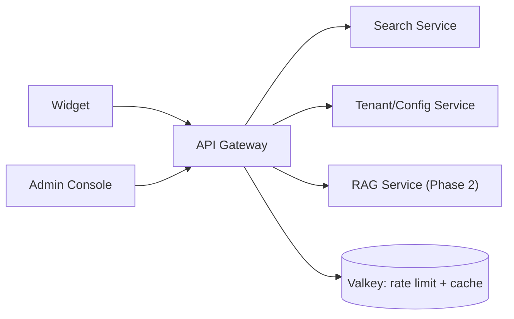

# S2 - API Gateway / BFF

> The single public entry point for the widget and admin console. Edge context. Phase 1.

## 1. Purpose and responsibilities

- Terminate all public traffic and act as the backend-for-frontend (BFF) for the widget.
- Authenticate tenants by API key; enforce origin allowlist, rate limits, and quotas.
- Resolve tenant context (`tenantId`, index `prefix`, `scopes`) and attach it to every downstream call.
- Validate/normalize requests and shape responses for the widget contract.
- Add correlation ids, emit access logs, metrics, and traces.
- Route to internal services (Search, Config, RAG) over the private network.

## 2. Technology stack

- NestJS (Fastify adapter), TypeScript.
- `helmet`, CORS, `@nestjs/throttler` with a Valkey store for distributed rate limiting.
- `class-validator`/`zod` for DTO validation.
- OpenTelemetry SDK for traces/metrics; `pino` for structured logs.

## 3. Architecture and position



## 4. Interface (public REST, prefix `/v1`)

| Method | Path | Purpose | Auth |
|---|---|---|---|
| GET | `/v1/config` | Widget bootstrap (tabs, theme, facets, flags) | public key |
| POST | `/v1/search` | Main search | public key |
| GET | `/v1/suggest` | As-you-type suggestions | public key |
| GET | `/v1/autocomplete` | Completion suggester | public key |
| POST | `/v1/answers` | RAG answer (Phase 2) | public key + flag |
| POST | `/v1/events` | Client analytics beacon (Phase 2) | public key |
| GET | `/healthz` `/readyz` `/metrics` | Ops | none/internal |

Example `POST /v1/search` request:

```json
{
  "query": "quarterly revenue report",
  "tab": "documents",
  "filters": { "tags": ["finance"], "metadata": { "year": 2026 } },
  "page": 1,
  "size": 10,
  "sort": "relevance"
}
```

Response envelope (abridged):

```json
{
  "query": "quarterly revenue report",
  "didYouMean": null,
  "tab": "documents",
  "total": 42,
  "page": 1,
  "size": 10,
  "took_ms": 73,
  "results": [
    { "id": "doc-123", "title": "Q1 2026 Revenue", "snippet": "...<em>revenue</em>...",
      "url": "https://...", "tags": ["finance"], "score": 0.87, "source": "document" }
  ],
  "facets": { "tags": [{ "value": "finance", "count": 30 }] }
}
```

## 5. Data owned / accessed

- Owns no persistent data. Uses Valkey for rate-limit counters and a short-TTL cache of tenant/key/config lookups (with event-based invalidation).

## 6. Dependencies

- Tenant/Config Service (key verification, config bootstrap).
- Search Service (search/suggest/autocomplete).
- RAG Service (answers, Phase 2).
- Valkey.

## 7. Configuration (env)

`PORT`, `REDIS_URL`, `CONFIG_SERVICE_URL`, `SEARCH_SERVICE_URL`, `RAG_SERVICE_URL`, `RATE_LIMIT_DEFAULT`, `CORS_STRICT` (bool), `CONFIG_CACHE_TTL_SECONDS`, `OTEL_EXPORTER_OTLP_ENDPOINT`, `LOG_LEVEL`.

## 8. Scaling and performance

- Stateless; scale horizontally behind the reverse proxy by QPS.
- Keep transforms cheap; stream large responses where possible.
- Cache `/v1/config` aggressively (per tenant), invalidated on config change.

## 9. Failure modes and resilience

- Per-dependency timeouts + circuit breakers (opossum or Nest interceptor).
- Search down: return `503` + `Retry-After`; never hang the widget.
- Config slow/miss: serve last-known-good cached config.
- Reject oversized/deeply paginated requests early (input validation).

## 10. Security considerations

- API keys presented as `Authorization: Bearer` or `x-api-key`; hashed before lookup.
- Origin/Referer checked against the key's allowlist; CORS reflects only allowed origins.
- Public keys are search-scoped; write/admin requires admin credentials.
- Strict DTO validation to prevent ES query injection; the gateway never forwards raw ES DSL from clients.
- Standard headers via helmet; request-size limits; per-key rate limits and quotas.

## 11. Observability

- Correlation id (`x-request-id`) generated/propagated to all downstream calls.
- Metrics: RED (rate, errors, duration) per route and per tenant; rate-limit rejections.
- Traces span gateway -> search/config -> ES.

## 12. Local development

- `pnpm --filter api-gateway start:dev`.
- Points to local Search/Config services or their mocks; Valkey via Docker Compose.

## 13. Testing

- Unit: guards (auth, origin), interceptors (rate limit), DTO validation.
- Integration: supertest against the gateway with mocked downstreams.
- Contract tests against the shared OpenAPI in `packages/shared-types`.

## 14. Implementation steps (Phase 1)

1. Scaffold `services/api-node` (NestJS + Fastify) with health/metrics.
2. Implement API-key auth guard (hash + lookup via Config Service, cached).
3. Implement origin allowlist + CORS and Valkey-backed throttler.
4. Add DTOs/validation for search/suggest/autocomplete/config.
5. Implement routing/BFF mapping to Search and Config; response shaping.
6. Add OpenTelemetry, structured logging, and circuit breakers.

## 15. Open questions / future work

- Split a dedicated public "search gateway" from an "admin gateway" as traffic grows.
- Optional GraphQL BFF for richer host integrations.
- Edge caching/CDN for `/v1/config` and popular `/v1/suggest` prefixes.
