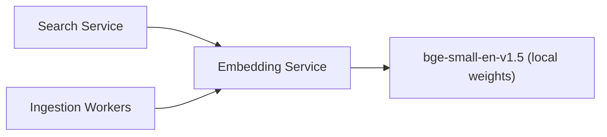

# S8 - Embedding Service

> Converts text to dense vectors for indexing and querying. Enrichment context. Phase 1.

## 1. Purpose and responsibilities

- Produce dense embeddings for passages (index time) and queries (search time).
- Be the single source of truth for the embedding model, dimensionality, and normalization so index-time and query-time vectors always match.
- Signal the model version so a model change can trigger a reindex.

## 2. Technology stack

- FastAPI wrapping `sentence-transformers` (Apache-2.0) with `BAAI/bge-small-en-v1.5` (MIT, 384-dim, cosine) - fully open-source and self-hosted, $0.
- Optional higher-throughput backend: ONNX Runtime via `optimum` (MIT/Apache-2.0) for faster CPU inference. (Hugging Face TEI is intentionally avoided due to its restrictive license.)
- Batched inference; optional GPU acceleration.

## 3. Architecture and position



## 4. Interface (internal REST)

| Method | Path | Purpose |
|---|---|---|
| POST | `/embed` | Embed a batch of texts |
| GET | `/model` | Model name, dim, normalization |
| GET | `/healthz` | Liveness (runs a test embedding) |

Request/response:

```json
// POST /embed
{ "texts": ["quarterly revenue"], "type": "query" }
// ->
{ "model": "bge-small-en-v1.5", "dim": 384, "vectors": [[0.01, -0.02, "..."]] }
```

Note: bge models benefit from an instruction prefix for queries; the service applies the correct prefix based on `type` (`query` vs `passage`) so callers do not have to.

## 5. Data owned / accessed

- Stateless. Model weights baked into the image or mounted from a cache volume.

## 6. Dependencies

- None at request time (self-contained).

## 7. Configuration (env)

`PORT`, `EMBEDDING_MODEL` (default `BAAI/bge-small-en-v1.5`), `EMBEDDING_DIM`, `MAX_BATCH_SIZE`, `NORMALIZE` (bool), `DEVICE` (`cpu`|`cuda`), `BACKEND` (`sentence-transformers`|`onnx`), `MODEL_CACHE_DIR`.

## 8. Scaling and performance

- Scale by batch throughput; CPU is fine for MVP, GPU for heavy ingestion.
- Keep a warm model in memory to avoid cold starts; cap batch size and queue length.
- For query latency, callers cache repeated/short-query vectors.

## 9. Failure modes and resilience

- Under overload return `429` so callers degrade to BM25-only search.
- Health check embeds a canary string and validates dimensionality.
- Model download failures fail readiness (do not serve wrong-dim vectors).

## 10. Security considerations

- Internal-only network exposure.
- Text sent for embedding may contain sensitive content; do not log payloads; run self-hosted to keep data in-boundary.

## 11. Observability

- Metrics: embeddings/sec, batch size distribution, p95 latency, queue depth, 429 rate.
- Emits the active `model`/`dim` as labels for correlation with index state.

## 12. Local development

- `uvicorn app.main:app --reload`; first run downloads weights to the cache dir.
- A tiny CLI script verifies `/embed` output shape and cosine sanity.

## 13. Testing

- Unit: prefix handling for query vs passage; normalization; batch splitting.
- Integration: dimensionality and determinism checks; 429 under synthetic load.
- Contract: `dim` matches the ES `dense_vector` mapping in fixtures.

## 14. Implementation steps (Phase 1)

1. Scaffold `services/analysis-ml` FastAPI (may co-host NER in MVP).
2. Load the model once at startup; implement `/embed` with batching and query/passage prefixes.
3. Expose `/model` and a canary `/healthz`.
4. Containerize with a pre-pulled model layer; document GPU and ONNX variants.
5. Add caching guidance for callers and load tests.

## 15. Open questions / future work

- Swap to a larger/multilingual model per tenant (dimension-aware reindex).
- Optional model warm-pool / gRPC transport to cut query-time embedding latency.
- Quantization (int8) for faster CPU inference.
