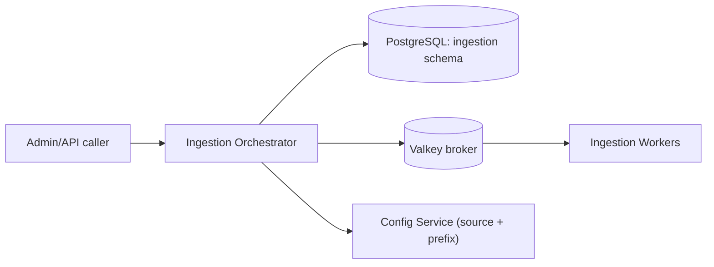

# S5 - Ingestion Orchestrator

> The control API for ingestion: accepts content, creates and tracks jobs, splits work into tasks, and enqueues them to the broker. Ingestion context. Phase 1.

## 1. Purpose and responsibilities

- Expose the ingestion control API (start jobs, check status, direct bulk upsert).
- Own the ingestion job lifecycle: create job -> split into tasks -> enqueue -> track -> finalize.
- Guarantee idempotency (content-hash doc ids) so retries are safe.
- Resolve source configuration and the target tenant index/prefix from the Config Service.
- Record dead-letter entries for poison tasks and expose them for replay.

## 2. Technology stack

- FastAPI (Python 3.12), Pydantic v2, Uvicorn.
- SQLAlchemy 2.x for job metadata in PostgreSQL (schema `ingestion`).
- Celery client (produces tasks; execution is in the Workers service).

## 3. Architecture and position



## 4. Interface (internal + admin REST)

| Method | Path | Purpose |
|---|---|---|
| POST | `/jobs/ingest` | Start ingestion (source id or inline payload); returns `jobId` |
| POST | `/jobs/reindex` | Rebuild an index version and swap the alias |
| POST | `/jobs/build-suggest` | Rebuild suggestion/completion data |
| POST | `/jobs/analyze` | Re-run enrichment over existing docs |
| GET | `/jobs/{id}` | Job status + per-task breakdown |
| GET | `/jobs` | List/filter jobs by tenant/status |
| POST | `/documents:bulk` | Direct bulk upsert (small batches) |
| GET | `/dead-letter` | List failed tasks for replay |
| POST | `/dead-letter/{id}:replay` | Re-enqueue a failed task |

Example `POST /jobs/ingest`:

```json
{ "tenantId": "acme", "sourceId": "docs-folder-1", "mode": "full", "options": { "chunk": true } }
```

Response: `{ "jobId": "job_01H...", "status": "queued", "taskCount": 128 }`

## 5. Data owned / accessed

- Owns the `ingestion` schema: `jobs`, `tasks`, `checkpoints`, `dead_letter`. Does not write content indices directly (Workers do that).

## 6. Dependencies

- Valkey (broker), Ingestion Workers, Config Service, PostgreSQL.

## 7. Configuration (env)

`PORT`, `DATABASE_URL`, `CELERY_BROKER_URL`, `CELERY_RESULT_BACKEND`, `CONFIG_SERVICE_URL`, `MAX_BULK_BATCH`, `DEFAULT_CHUNK_SIZE`, `DEFAULT_CHUNK_OVERLAP`, `LOG_LEVEL`.

## 8. Scaling and performance

- Lightweight API; a couple of replicas suffice. The heavy lifting is in Workers.
- Batch task creation and use server-side cursors when fanning out large jobs.

## 9. Failure modes and resilience

- Jobs and tasks are idempotent (stable doc ids from content hashes).
- A job aggregates task results and reports `succeeded` / `failed` / `partial`.
- Poison tasks route to a dead-letter table after max retries; operators can inspect and replay.
- If the Config Service is unavailable at job-creation time, the request fails fast (no ambiguous index target).

## 10. Security considerations

- Internal/admin-only surface (not exposed to the widget). Admin auth required for job creation.
- Validates `tenantId`/`sourceId` ownership before enqueuing to prevent cross-tenant writes.

## 11. Observability

- Metrics: jobs created, task fan-out size, queue depth, job duration, failure rate, dead-letter count.
- Structured job/task logs correlated by `jobId`.

## 12. Local development

- `uvicorn app.main:app --reload` with Compose Valkey + PostgreSQL.
- A sample-data folder and `POST /jobs/ingest` recipe seed the demo tenant.

## 13. Testing

- Unit: job/task planning, idempotency key derivation, DTO validation.
- Integration: enqueue against a real broker (Testcontainers Valkey) and assert task messages.
- Contract: job status shape shared with the Admin Console.

## 14. Implementation steps (Phase 1)

1. Scaffold `services/ingestion` FastAPI app with health checks and the `ingestion` schema (SQLAlchemy + Alembic).
2. Implement job/task models and the idempotency scheme.
3. Implement `/jobs/ingest`, `/jobs/{id}`, `/documents:bulk`.
4. Wire the Celery client and task fan-out; implement `chord`-based finalization callback.
5. Add reindex + alias-swap orchestration and `build-suggest`.
6. Add dead-letter listing/replay endpoints.

## 15. Open questions / future work

- Move to Kafka/RabbitMQ for very high throughput and exactly-once semantics.
- Change-data-capture (CDC) source mode for near-real-time updates.
- Per-source concurrency limits and fair scheduling across tenants.
