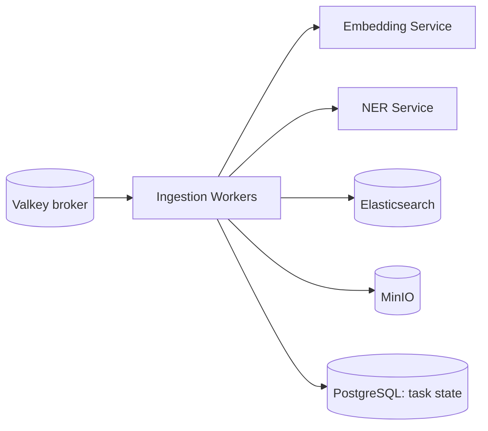

# S6 - Ingestion Workers

> Execute the ingestion pipeline: fetch, normalize, chunk, enrich, store, and index. Ingestion context. Phase 1.

## 1. Purpose and responsibilities

- Run ingestion tasks asynchronously: pull from a connector, parse/normalize to the canonical document, chunk for RAG, call enrichment (embeddings + NER), store blobs/thumbnails in MinIO, and bulk-index into the correct tenant index.
- Emit progress/checkpoints and update job/task state.
- Isolate slow/faulty sources so they never affect the query path.

## 2. Technology stack

- Celery workers (Python). Broker = Valkey (RabbitMQ/Kafka at scale); result backend = Valkey or PostgreSQL.
- Connector plugins implementing a common interface.
- Parsers: `unstructured`, `pypdf`, `python-docx`, `beautifulsoup4`; images via `Pillow`; optional OCR via `pytesseract`.
- `elasticsearch` Python client for bulk indexing; `boto3`/`minio` for object storage.

## 3. Architecture and position



## 4. Interface (Celery tasks, not HTTP)

| Task | Input -> Output |
|---|---|
| `ingest.fetch` | `source_ref` -> raw records |
| `ingest.normalize` | raw -> canonical doc(s) |
| `ingest.chunk` | doc -> chunks |
| `ingest.enrich` | doc/chunk -> embeddings + entities (calls S8/S9) |
| `ingest.thumbnail` | image -> thumbnail in MinIO |
| `ingest.index` | batch -> ES bulk upsert |
| `ingest.finalize` | chord callback -> job status |

Canonical document (normalized shape indexed into ES):

```json
{
  "id": "sha1(tenant+source+natural_key)",
  "tenant_id": "acme",
  "source": "document",
  "title": "Q1 2026 Revenue",
  "body": "full text ...",
  "url": "https://...",
  "tags": ["finance", "report"],
  "metadata": { "year": 2026, "department": "finance" },
  "entities": ["ACME Corp", "2026"],
  "embedding": [/* 384 floats */],
  "created_at": "2026-01-31T00:00:00Z"
}
```

## 5. Data owned / accessed

- Writes Elasticsearch content indices and MinIO objects; updates task/job state in PostgreSQL. Reads source config via the Config Service.

## 6. Dependencies

- Valkey, Embedding Service, NER Service, Elasticsearch, MinIO, Config Service.

## 7. Configuration (env)

`CELERY_BROKER_URL`, `CELERY_RESULT_BACKEND`, `ELASTICSEARCH_URL`, `ELASTICSEARCH_API_KEY`, `EMBEDDING_SERVICE_URL`, `NER_SERVICE_URL`, `MINIO_ENDPOINT`, `MINIO_ACCESS_KEY`, `MINIO_SECRET_KEY`, `CONFIG_SERVICE_URL`, `WORKER_CONCURRENCY`, `PREFETCH_MULTIPLIER`, `BULK_BATCH_SIZE`, `MAX_RETRIES`, `RETRY_BACKOFF`.

## 8. Scaling and performance

- Horizontal by broker backlog depth (queue-length autoscaling, e.g., KEDA in K8s).
- Dedicated queues per task type (heavy `enrich` vs light `index`) to avoid head-of-line blocking.
- Optional GPU worker pool for enrichment-heavy tenants; bounded prefetch for backpressure.
- Bulk-index in batches; tune `BULK_BATCH_SIZE` against ES ingest capacity.

## 9. Failure modes and resilience

- Per-task retry with exponential backoff + jitter; exhausted retries -> dead-letter.
- Bulk-index handles partial item failures and reports per-item errors.
- Connector timeouts and circuit breakers isolate slow sources.
- Enrichment failure is non-fatal: index without the missing enrichment and queue a re-enrich task.

## 10. Security considerations

- Least-privilege ES key (write only to the tenant's index pattern).
- Never logs full document bodies (may contain PII); logs ids/hashes.
- Optional PII detection/redaction via NER before indexing (Phase 2).

## 11. Observability

- Metrics: task throughput/latency per type, retry/dead-letter counts, bulk error rate, per-source lag. (Flower for live task/worker view.)
- Traces span worker -> embed/ner and worker -> ES.

## 12. Local development

- `celery -A app.worker worker -Q ingest,enrich,index -l info` plus `flower` against Compose Valkey.
- A local docs folder connector makes end-to-end testing easy without external systems.

## 13. Testing

- Unit: parsers/normalizers per file type, chunker boundaries, idempotency.
- Integration: full pipeline against ephemeral ES + MinIO + mocked enrichment.
- Fault injection: simulate enrichment 429s and ES partial failures.

## 14. Implementation steps (Phase 1)

1. Scaffold `services/ingestion` Celery app sharing models with the Orchestrator.
2. Define the connector interface and implement MVP connectors: file/JSON upload, local folder, generic REST/DB pull.
3. Implement normalize + chunk + enrich (call S8/S9) + thumbnail + bulk index tasks.
4. Compose the pipeline with chains/groups and a `chord` finalizer.
5. Add retry/backoff, dead-letter routing, and per-queue workers.
6. Verify throughput target (> 200 docs/s text on one worker).

## 15. Open questions / future work

- Additional connectors: S3/GCS, RSS/news, Confluence/SharePoint, databases via CDC.
- Incremental/delta sync and deletion propagation (tombstones).
- Deduplication/canonicalization across sources.
- CLIP image embeddings for visual similarity (Phase 2).
