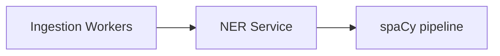

# S9 - NER Service

> Extracts named entities from content for entity facets and (later) PII detection/redaction. Enrichment context. Phase 1.

## 1. Purpose and responsibilities

- Extract named entities (people, organizations, locations, dates, money, custom types) from document text at ingest time.
- Provide the `entities` field used for entity facets and filtering.
- Foundation for PII detection/redaction and document-level security (Phase 2/3).

## 2. Technology stack

- FastAPI wrapping spaCy: `en_core_web_lg` by default; optional transformer pipeline `en_core_web_trf` for higher accuracy.
- Pluggable spaCy `EntityRuler` for tenant-specific custom entities (product names, SKUs, internal codes).

## 3. Architecture and position



## 4. Interface (internal REST)

| Method | Path | Purpose |
|---|---|---|
| POST | `/ner` | Extract entities from a batch of texts |
| GET | `/healthz` | Liveness |

Request/response:

```json
// POST /ner
{ "texts": ["ACME Corp reported 2026 revenue in Berlin."], "types": ["ORG","GPE","DATE"] }
// ->
{ "entities": [[
  { "text": "ACME Corp", "label": "ORG", "start": 0, "end": 9, "score": 0.98 },
  { "text": "2026", "label": "DATE", "start": 24, "end": 28, "score": 0.95 },
  { "text": "Berlin", "label": "GPE", "start": 41, "end": 47, "score": 0.97 }
]] }
```

## 5. Data owned / accessed

- Stateless. Optional per-tenant entity-ruler patterns loaded from config.

## 6. Dependencies

- None at request time (self-contained). Reads custom patterns from config at load/refresh.

## 7. Configuration (env)

`PORT`, `SPACY_MODEL` (default `en_core_web_lg`), `USE_TRANSFORMER` (bool), `MAX_BATCH_SIZE`, `DEVICE`, `ENTITY_TYPES`, `CUSTOM_RULER_URL`.

## 8. Scaling and performance

- CPU-bound; scale by ingestion volume. Batch documents; the transformer model is far slower but more accurate - choose per tenant.
- Can share a container with the Embedding Service in MVP; split when volumes diverge.

## 9. Failure modes and resilience

- NER failures are non-fatal to ingestion: the document indexes without `entities` and is queued for re-enrichment.
- Overload returns `429`; the worker retries later.

## 10. Security considerations

- Internal-only. Text may contain PII; do not log payloads; run self-hosted to keep data in-boundary.
- Entity output can drive PII detection/redaction policies (Phase 2).

## 11. Observability

- Metrics: docs/sec, entities/doc distribution, p95 latency, 429 rate, model in use.

## 12. Local development

- `uvicorn app.main:app --reload`; `python -m spacy download en_core_web_lg` on first setup.

## 13. Testing

- Unit: label mapping, type filtering, custom ruler patterns.
- Integration: golden entity sets for sample documents; batch correctness.

## 14. Implementation steps (Phase 1)

1. Add the NER app to `services/analysis-ml` (or a dedicated service).
2. Load the spaCy model once; implement `/ner` with batching and type filtering.
3. Support optional per-tenant `EntityRuler` patterns.
4. Containerize with the model pre-downloaded.

## 15. Open questions / future work

- PII detection + redaction pipeline and policy engine (Phase 2).
- Multilingual NER models per tenant/locale.
- Entity linking/normalization (canonical entity ids) for better faceting.
