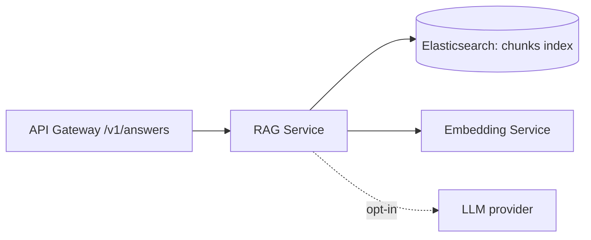

# S12 - RAG Service

> Produces grounded, cited natural-language answers from tenant content. Query context. Phase 2.

## 1. Purpose and responsibilities

- On an "answers" request, retrieve the most relevant chunks (hybrid) from the tenant's `-chunks` index, assemble a grounded prompt, call the tenant's configured LLM, and return an answer with citations and a confidence signal.
- Enforce guardrails: context-size limits, cost/latency budgets, and refusal when evidence is weak.
- Keep the LLM pluggable and opt-in per tenant; the default is a **self-hosted open-weight model** ($0, no data egress), with external hosted providers available only if a tenant explicitly opts in.

## 2. Technology stack

- FastAPI (Python). Retrieval via the Search Service or direct ES. LLM via a provider abstraction. **Default: self-hosted, Apache-2.0 open-weight models** (e.g., Mistral 7B, Qwen2.5) served by **Ollama / vLLM / llama.cpp** - $0 and fully offline. External hosted providers stay pluggable but are opt-in per tenant (they incur cost and send data off-box).
- Prompt templates with citation formatting; optional streaming (SSE) responses.

## 3. Architecture and position



## 4. Interface (internal REST)

| Method | Path | Purpose |
|---|---|---|
| POST | `/answers` | Generate an answer for a query (optional streaming) |
| GET | `/healthz` | Liveness |

Response (abridged):

```json
{
  "answer": "Q1 2026 revenue was ...",
  "citations": [{ "id": "doc-123#c4", "title": "Q1 2026 Revenue", "url": "https://..." }],
  "confidence": 0.72,
  "used_model": "self-hosted:qwen2.5-7b-instruct"
}
```

## 5. Data owned / accessed

- Reads the tenant `-chunks` index. Caches answers by normalized query + filter fingerprint (Valkey). No content ownership.

## 6. Dependencies

- Elasticsearch, Embedding Service, LLM provider (opt-in), Valkey (answer cache), Config Service (per-tenant model + flags).

## 7. Configuration (env)

`PORT`, `ELASTICSEARCH_URL`, `EMBEDDING_SERVICE_URL`, `REDIS_URL`, `LLM_PROVIDER`, `LLM_BASE_URL`, `LLM_API_KEY`, `MAX_CONTEXT_TOKENS`, `TOP_K_CHUNKS`, `ANSWER_CACHE_TTL`, `COST_BUDGET_PER_QUERY`.

## 8. Scaling and performance

- Latency-dominated by the LLM; stream tokens to the widget for perceived speed.
- Cache answers for popular queries; cap `TOP_K_CHUNKS` and context tokens.
- Scale retrieval and generation independently; consider a self-hosted LLM pool.

## 9. Failure modes and resilience

- LLM unavailable/over budget -> return retrieved passages without generation (graceful "sources only" mode).
- Weak evidence -> return "no confident answer" with the top sources rather than hallucinating.
- Timeouts abort generation and fall back to sources.

## 10. Security considerations

- LLM is opt-in per tenant; external providers only when the tenant explicitly enables them (data-egress consent).
- Enforce tenant scoping on chunk retrieval (mandatory `tenant_id` filter).
- Prompt-injection mitigations: content is clearly delimited; system instructions are fixed; never execute retrieved instructions.

## 11. Observability

- Metrics: answer latency (retrieve vs generate), cache hit rate, refusal rate, tokens/cost per tenant.
- Log query hash, chosen model, citation ids (not raw content).

## 12. Local development

- Run against a local Ollama for a fully offline dev loop.

## 13. Testing

- Unit: prompt assembly, citation mapping, budget guards.
- Integration: retrieval + a stub LLM; refusal on empty retrieval.
- Evaluation: faithfulness/groundedness checks on a curated Q/A set.

## 14. Implementation steps (Phase 2)

1. Build the chunk retrieval path (reuse Search Service hybrid retrieval).
2. Implement the LLM provider abstraction (self-hosted first, external opt-in).
3. Implement prompt templates, citation formatting, and confidence estimation.
4. Add answer caching, budgets, streaming, and refusal logic.
5. Wire `/v1/answers` through the gateway behind a per-tenant flag; add the widget Answers tab.

## 15. Open questions / future work

- Agentic multi-step retrieval and tool use.
- Per-tenant fine-tuned or private models.
- Feedback loop (thumbs up/down) into relevance and prompt tuning.
