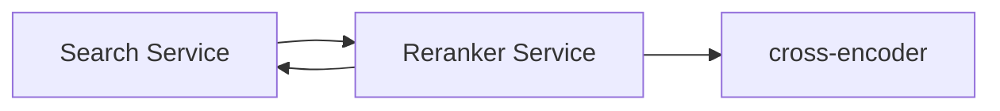

# S14 - Reranker Service

> Optional second-stage cross-encoder that reorders top-N results for precision. Query context. Phase 2/3.

## 1. Purpose and responsibilities

- Take the top-N fused results (from hybrid RRF) and rerank them with a cross-encoder that jointly scores (query, document) pairs for higher precision at the top.
- Operate behind a per-tenant flag and a strict latency budget.

## 2. Technology stack

- FastAPI wrapping a self-hosted cross-encoder (e.g., `BAAI/bge-reranker-base`/`-large`, MIT) via sentence-transformers (Apache-2.0) - $0, fully open-source. An external rerank API stays pluggable but is opt-in (it costs money and sends data off-box). GPU recommended for larger models.

## 3. Architecture and position



## 4. Interface (internal REST)

| Method | Path | Purpose |
|---|---|---|
| POST | `/rerank` | Rerank candidates for a query |
| GET | `/healthz` | Liveness |

Request/response:

```json
// POST /rerank
{ "query": "revenue report", "candidates": [{ "id": "d1", "text": "..." }], "top_k": 10 }
// ->
{ "results": [{ "id": "d1", "score": 8.42 }] }
```

## 5. Data owned / accessed

- Stateless; receives candidate texts from the Search Service.

## 6. Dependencies

- None at request time (model runs locally); an external rerank API is used only if a tenant opts in.

## 7. Configuration (env)

`PORT`, `RERANKER_MODEL`, `MAX_CANDIDATES`, `DEVICE`, `LATENCY_BUDGET_MS`, `BACKEND` (`local`|`external`).

## 8. Scaling and performance

- Cost scales with N candidates x sequence length; keep N small (e.g., 50 -> top 10).
- Enforce a latency budget; skip reranking if the budget would be exceeded.
- GPU pool for larger models; batch pairs.

## 9. Failure modes and resilience

- On timeout/overload, return the original RRF order (reranking is an enhancement, never a hard dependency).

## 10. Security considerations

- Internal-only; candidate text may be sensitive - do not log payloads; prefer self-hosted.

## 11. Observability

- Metrics: rerank latency, candidates processed, skip-due-to-budget rate, score deltas.

## 12. Local development

- Run the base model on CPU for functional tests; validate ordering changes.

## 13. Testing

- Unit: candidate truncation, budget skip logic.
- Evaluation: NDCG/MRR uplift vs RRF-only on the golden query set.

## 14. Implementation steps (Phase 2/3)

1. Stand up the cross-encoder service with `/rerank`.
2. Integrate as an optional second stage in the Search Service behind a per-tenant flag.
3. Add the latency-budget guard and graceful fallback.
4. Measure relevance uplift and cost; enable per tenant where it helps.

## 15. Open questions / future work

- Instruction-following rerankers for domain-specific relevance.
- Distillation to a cheaper model to reduce latency/cost.
- Combine with learning-to-rank signals.
