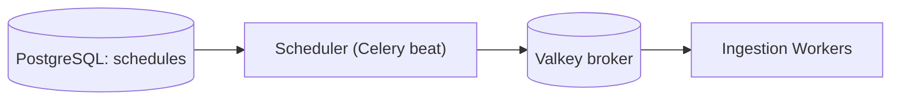

# S7 - Scheduler (Celery beat)

> Triggers recurring ingestion pulls and maintenance jobs from runtime-configurable schedules. Ingestion context. Phase 1.

## 1. Purpose and responsibilities

- Enqueue recurring jobs based on per-source schedules stored in configuration: source pulls, suggestion rebuilds, analytics rollups, and index-health checks.
- Keep schedules configurable at runtime (no image rebuild to change a cron).

## 2. Technology stack

- Celery beat with a database-backed schedule store (so schedules live in PostgreSQL, editable via the Admin API), broker = Valkey.

## 3. Architecture and position



## 4. Interface

- No public API. Reads schedules from the DB and produces Celery tasks. Schedules are managed via the Admin API / Config Service.

Example schedule record:

```json
{ "tenantId": "acme", "sourceId": "news-rss-1", "cron": "*/30 * * * *", "task": "jobs.ingest", "enabled": true }
```

## 5. Data owned / accessed

- Reads the schedule table (owned by Config). Writes nothing except its own last-run bookkeeping.

## 6. Dependencies

- PostgreSQL (schedule store), Valkey (broker).

## 7. Configuration (env)

`CELERY_BROKER_URL`, `DATABASE_URL`, `BEAT_MAX_LOOP_INTERVAL`, `LEADER_LOCK_KEY`, `LOG_LEVEL`.

## 8. Scaling and performance

- Exactly one active instance to avoid duplicate ticks. Use a leader lock (Valkey) so a standby can take over on failure.

## 9. Failure modes and resilience

- Missed ticks are tolerable because jobs are idempotent; a periodic index-health job detects and repairs stale indices.
- On restart, it does not replay missed windows (avoids thundering herd); the next scheduled window runs normally.

## 10. Security considerations

- Internal only; no external surface. Schedule edits go through the authenticated Admin API.

## 11. Observability

- Metrics: ticks emitted, tasks enqueued per schedule, leader-election changes.
- Logs each enqueue with `tenantId`/`sourceId`.

## 12. Local development

- `celery -A app.worker beat -l info` alongside a worker; edit schedules via a seed script.

## 13. Testing

- Unit: cron parsing, enable/disable logic, leader-lock behavior.
- Integration: verify a due schedule enqueues exactly one task with a single active beat.

## 14. Implementation steps (Phase 1)

1. Add a database-backed beat schedule (e.g., a custom scheduler reading the schedule table).
2. Implement the Valkey leader lock for single-active execution.
3. Register maintenance jobs (index-health, suggestion rebuild) with sensible default crons.
4. Wire schedule CRUD through the Admin API.

## 15. Open questions / future work

- Per-tenant fair scheduling and rate caps to smooth load spikes.
- Timezone-aware schedules per tenant.
- Migrate to a dedicated scheduler (e.g., Temporal) if workflow complexity grows.
