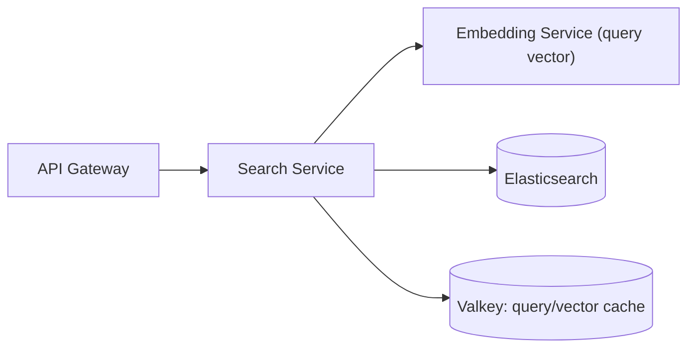

# S3 - Search Service

> Translates tenant-scoped requests into Elasticsearch queries and executes hybrid retrieval, facets, suggestions, and did-you-mean. Query context. Phase 1.

## 1. Purpose and responsibilities

- Build and execute hybrid (BM25 + kNN) queries fused with Reciprocal Rank Fusion (RRF).
- Compute aggregations (facets), highlighting, suggestions, and spelling correction.
- Apply per-tenant ranking configuration (boosts, synonyms, field weights).
- Resolve the correct tenant indices/aliases from the tenant prefix and requested tab.
- Map Elasticsearch responses into the stable API contract.

## 2. Technology stack

- NestJS + TypeScript.
- Official `@elastic/elasticsearch` client.
- A `query-builder` module encapsulating client-side RRF fusion, facets, highlighting, and suggestions (with an optional native-`rrf` path for licensed clusters).

## 3. Architecture and position



## 4. Interface (internal)

| Method | Path | Purpose |
|---|---|---|
| POST | `/search` | Hybrid search with facets, filters, paging, sort |
| GET | `/suggest` | Word-by-word autocomplete via `auto_complete-{prefix}` edge ngrams (falls back to title `search_as_you_type`) |
| GET | `/autocomplete` | Same as `/suggest` (word suggestions) |
| POST | `/did-you-mean` | Spelling correction (also embedded in `/search`) |

Hybrid search on the free Elasticsearch Basic tier uses **client-side RRF**: the service runs two queries against the resolved alias and fuses them by rank (the native `rrf` retriever returns HTTP 403 without an Enterprise license).

Query 1 - BM25 (with facets + highlighting):

```json
{
  "query": { "bool": {
    "must": [{ "multi_match": { "query": "q", "fields": ["title^2","body"] } }],
    "filter": [{ "term": { "tenant_id": "acme" } }]
  } },
  "aggs": { "tags": { "terms": { "field": "tags", "size": 20 } } },
  "highlight": { "fields": { "body": {} } }
}
```

Query 2 - kNN (vector from the Embedding Service):

```json
{
  "knn": { "field": "embedding", "query_vector": [ /* 384 floats */ ],
           "k": 50, "num_candidates": 200,
           "filter": [{ "term": { "tenant_id": "acme" } }] }
}
```

Fusion: `score(doc) = Σ 1 / (rank_constant + rank)` across both lists (`rank_constant` 60), then sort and paginate. When `HYBRID_MODE=native_rrf` (a licensed cluster), the same inputs are sent as a single `retriever.rrf` request instead.

## 5. Data owned / accessed

- Reads Elasticsearch content indices via aliases. Never writes content indices.
- Optional Valkey cache for hot-query results and repeated short-query vectors.

## 6. Dependencies

- Elasticsearch, Embedding Service (query embedding), Valkey. Tenant ranking/facet config is passed down from the gateway to avoid an extra hop.

## 7. Configuration (env)

`PORT`, `ELASTICSEARCH_URL`, `ELASTICSEARCH_API_KEY`, `EMBEDDING_SERVICE_URL`, `REDIS_URL`, `RRF_RANK_CONSTANT` (default 60), `RRF_RANK_WINDOW` (default 100), `KNN_K`, `KNN_NUM_CANDIDATES`, `HYBRID_MODE` (`client_rrf` default | `native_rrf` for licensed clusters), `MAX_PAGE_SIZE`, `QUERY_CACHE_TTL`.

## 8. Scaling and performance

- Stateless; scale by search QPS.
- Query-embedding latency is the main additive cost - cache vectors for repeated/short queries and keep an in-process LRU.
- Cap `from + size`; encourage `search_after` for deep pagination.
- Tune `num_candidates` vs recall/latency; benchmark hybrid against BM25-only and vector-only.

## 9. Failure modes and resilience

- Embedding Service unavailable -> degrade gracefully to BM25-only (still returns useful results).
- Client-side RRF (`client_rrf`) is the default on the free tier (runs BM25 and kNN separately, fuses by rank in-process); `native_rrf` is used only on a licensed cluster. Both share the same builder inputs.
- ES timeouts -> return partial results and a `degraded` flag.

## 10. Security considerations

- Every query includes a mandatory `tenant_id` filter (defense-in-depth) in addition to alias scoping.
- Uses a least-privilege ES API key (read on tenant index pattern only).
- No client-supplied raw ES DSL is executed; only builder-produced queries.

## 11. Observability

- Metrics: query latency (split into embed vs ES vs total), hybrid mode used, zero-result rate, facet timings.
- Logs: query hash (not raw PII), tenant, tab, result count.
- Traces: search -> embed and search -> ES spans.

## 12. Local development

- `pnpm --filter search-service start:dev` against Compose ES + Embedding.
- Kibana Dev Tools for building/inspecting queries.

## 13. Testing

- Unit: query-builder output snapshots for each tab/filter combination.
- Integration: against a seeded ephemeral ES (Testcontainers) verifying relevance ordering, facets, highlighting, suggest, did-you-mean.
- Relevance regression: a golden query set scored with NDCG/MRR in CI.

## 14. Implementation steps (Phase 1)

1. Scaffold `services/search-service` with the ES client and health checks.
2. Implement tenant/tab -> alias resolution and mandatory tenant filter.
3. Implement the query-builder: multi_match + kNN with client-side RRF fusion, facets, highlighting.
4. Add suggest (`search_as_you_type`) and did-you-mean (`phrase`/`term` suggester + fuzzy).
5. Ensure BM25-only degradation when Embedding is unavailable; keep an optional `native_rrf` path behind `HYBRID_MODE`.
6. Wire query embedding via the Embedding Service with caching.
7. Add relevance regression tests with a golden set.

## 15. Open questions / future work

- Cross-encoder reranking of top-N (Reranker Service, Phase 2/3).
- Query classification to route short vs long queries to different blends.
- Learning-to-rank with click signals (Phase 3).
- Multi-index (cross-tab "All") relevance normalization strategy.
