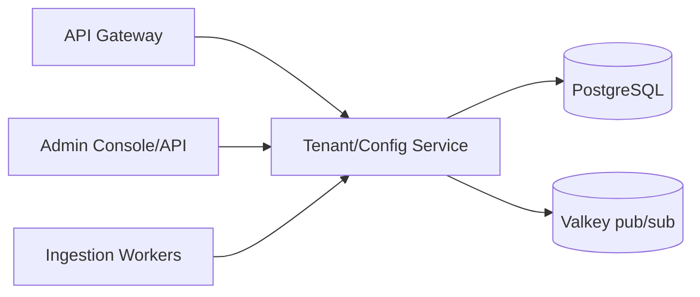

# S4 - Tenant / Config Service

> System of record for tenants, API keys, sources, tabs, and search configuration. Control context. Phase 1.

## 1. Purpose and responsibilities

- Store and serve all tenant configuration: tenants, API keys, sources, tab config, search config (synonyms, boosts, facets, suggest settings), theming, and quotas.
- Provide fast, cached read APIs for the gateway and search plane.
- Provide admin-authenticated write APIs for onboarding and tuning (the "Admin API", see [admin-api.md](admin-api.md)).
- Publish config-change events so caches invalidate promptly.

## 2. Technology stack

- NestJS + TypeScript, Prisma ORM, PostgreSQL 16.
- Valkey pub/sub for cache invalidation.
- JWT/OIDC + RBAC for admin auth (hardened in Phase 3).

## 3. Architecture and position

## 4. Interface (internal + admin REST)

Read (internal, used by gateway/search/workers):

| Method | Path | Purpose |
|---|---|---|
| GET | `/tenants/:id` | Tenant record |
| POST | `/keys/verify` | Verify an API key by hash -> tenant context |
| GET | `/tenants/:id/config` | Aggregated widget bootstrap config |
| GET | `/tenants/:id/search-config` | Synonyms, boosts, facets, suggest |
| GET | `/tenants/:id/sources` | Source definitions |

Admin write (auth required):

| Method | Path | Purpose |
|---|---|---|
| POST | `/tenants` | Create tenant (allocates `prefix`) |
| POST | `/tenants/:id/keys` | Issue/revoke API keys |
| PUT | `/tenants/:id/tabs` | Configure tabs |
| PUT | `/tenants/:id/search-config` | Tune relevance |
| POST | `/tenants/:id/sources` | Register a source/connector |

## 5. Data owned / accessed

- **Owns PostgreSQL** (config schema). It is the only service permitted to access the config DB directly. Schema detail lives in the master plan (Data architecture) and [postgresql.md](postgresql.md).

Core tables: `tenants`, `api_keys`, `sources`, `tab_config`, `search_config`, `audit_log`.

## 6. Dependencies

- PostgreSQL, Valkey. No hard dependency on other application services.

## 7. Configuration (env)

`PORT`, `DATABASE_URL`, `REDIS_URL`, `API_KEY_HASH_ALGO` (argon2id), `ADMIN_JWT_ISSUER`, `ADMIN_JWT_AUDIENCE`, `CONFIG_EVENT_CHANNEL`, `LOG_LEVEL`.

## 8. Scaling and performance

- Read-mostly and cache-heavy; small replica count.
- Aggregated `/config` responses are computed once and cached by consumers with event-based invalidation.
- Writes are infrequent (admin actions).

## 9. Failure modes and resilience

- Consumers cache config and key lookups; a brief Config outage does not stop search.
- Key revocation: short TTL (30-60 s) plus an explicit invalidation event for immediate effect.
- DB migrations run as gated deploy steps (Prisma migrate) with backward-compatible changes.

## 10. Security considerations

- API keys stored only as salted hashes (argon2id); prefix stored in clear for display (`pk_live_...`).
- Admin endpoints require JWT/OIDC + RBAC; all writes are audited (`audit_log`).
- Tenant `prefix` is validated and immutable after creation to protect index isolation.

## 11. Observability

- Metrics: config read/verify latency, cache hit ratio (as seen by consumers), write/audit counts.
- Audit log for every admin mutation (who/what/when/before-after).

## 12. Local development

- `pnpm --filter tenant-config start:dev` with Compose PostgreSQL + Valkey.
- `prisma migrate dev` + a seed script that creates a demo tenant and a public key.

## 13. Testing

- Unit: key hashing/verification, config aggregation, RBAC guards.
- Integration: Prisma against an ephemeral PostgreSQL (Testcontainers); event emission on change.
- Contract: `/keys/verify` and `/config` shapes pinned in `packages/shared-types`.

## 14. Implementation steps (Phase 1)

1. Scaffold `services/tenant-config` (NestJS + Prisma).
2. Define Prisma schema and initial migration for the core tables.
3. Implement key issuance/verification (argon2id) and origin allowlist storage.
4. Implement read APIs + aggregated `/config`; publish invalidation events.
5. Implement admin write APIs with validation and audit logging.
6. Seed a demo tenant, source, tabs, and a public key.

## 15. Open questions / future work

- Extract the Admin API into its own deployable (Phase 2).
- Config versioning + staged rollout / preview (draft vs published).
- Per-tenant feature-flag service integration.
- Self-serve onboarding portal.
