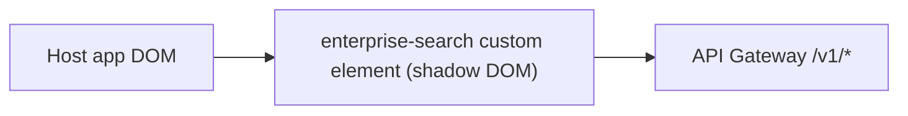

# S1 - Search Widget (`enterprise-search`)

> The embeddable, framework-agnostic search UI shipped as a Web Component. Presentation context. Phase 1.

## 1. Purpose and responsibilities

- Provide a Google-like search experience that any host application embeds with one line of code.
- Render the collapsed search bar and, on interaction, an expanded results surface with tabs (All, Documents, News, Images), autosuggest, did-you-mean, facet filters, highlighting, and pagination.
- Read tenant configuration (enabled tabs, theming, facet definitions) at load and adapt the UI.
- Emit DOM events so the host can hook analytics and navigation.
- Isolate itself completely from host CSS/JS using shadow DOM.

## 2. Technology stack

- React 18 + TypeScript.
- Vite for building; a dedicated multi-entry build produces the custom-element bundle.
- `@r2wc/react-to-web-component` v2 to wrap the React app as a custom element.
- TanStack Query for fetching, caching, debouncing, cancellation.
- Styling scoped inside shadow DOM; CSS variables for theming tokens.
- No global state library needed; local state + query cache suffice.

## 3. Architecture and position



The element is the only platform code running in the host page. It talks exclusively to the API Gateway over HTTPS.

## 4. Interface (custom element contract)

Attributes / properties:

| Name | Type | Required | Description |
|---|---|---|---|
| `tenant-key` | string | yes | Public searchable API key |
| `api-base` | string (URL) | yes | Gateway base URL, e.g. `https://search.acme.com` |
| `theme` | json | no | Theming token overrides |
| `tabs` | json | no | Client-side tab override (else from `/v1/config`) |
| `locale` | string | no | BCP-47 locale (default `en`) |
| `placeholder` | string | no | Input placeholder text |

Emitted events (all `bubbles: true, composed: true`):

| Event | `detail` payload |
|---|---|
| `search` | `{ query, tab, filters }` |
| `resultclick` | `{ id, url, tab, rank }` |
| `suggestselect` | `{ suggestion }` |
| `tabchange` | `{ tab }` |

Usage in any host:

```html
<script type="module" src="https://cdn.acme.com/enterprise-search.js"></script>
<enterprise-search
  tenant-key="pk_live_acme_xxx"
  api-base="https://search.acme.com">
</enterprise-search>
```

## 5. Data owned / accessed

- No server-side data. Optional `localStorage` for recent searches, namespaced by tenant key. Respects a `disable-history` attribute for privacy-sensitive hosts.

## 6. Dependencies

- API Gateway endpoints: `GET /v1/config`, `POST /v1/search`, `GET /v1/suggest`, `GET /v1/autocomplete`, and `POST /v1/events` (Phase 2).

## 7. Configuration

Runtime config comes from element attributes plus `/v1/config`. Build-time config: target browsers, element tag name (default `enterprise-search`), CDN base for assets.

## 8. Scaling and performance

- Served as a static, cacheable, immutable asset via CDN; versioned filenames.
- Performance budget: < 120 KB gzip (MVP), first interaction < 100 ms after script load.
- Debounce suggest (approx 120-180 ms), cancel superseded requests, prefetch next result page.

## 9. Failure modes and resilience

- If `/v1/config` fails: render default tabs and a neutral theme.
- If a search request fails: show a friendly retryable error; keep last good results visible.
- Network offline: disable input with an inline notice; auto-recover on reconnect.
- Guard against XSS: never `dangerouslySetInnerHTML` except for server-sanitized highlight fragments.

## 10. Security considerations

- Only the public (search-scoped) key is exposed in the browser - never admin keys.
- Origin allowlist is enforced server-side; the key alone cannot be abused from unlisted origins.
- Shadow DOM prevents host CSS/JS from tampering with the widget internals.

## 11. Observability

- Optional client beacons to `POST /v1/events` (impressions, clicks, zero-result) for analytics.
- Console diagnostics behind a `debug` attribute; never logs the raw key.

## 12. Local development

- `pnpm --filter widget dev` runs a Vite dev host page with a mock/local gateway.
- A `demo/host.html` shows integration in plain HTML; framework examples for React/Angular/Vue.

## 13. Testing

- Unit: React Testing Library for components (search box, tabs, facets, suggestions).
- Integration: mounted custom element against a mocked gateway (MSW).
- Cross-framework smoke: render the element inside React, Vue, and vanilla hosts.
- Accessibility: `axe` checks for the combobox/listbox ARIA pattern and keyboard flows.

## 14. Implementation steps (Phase 1)

1. Scaffold `apps/widget` (Vite + React + TS).
2. Build the search box, suggestions dropdown, tabbed results, facet panel, did-you-mean line as React components with a typed API client.
3. Add TanStack Query hooks for `config/search/suggest/autocomplete` with debounce and cancellation.
4. Implement theming via CSS variables and the `theme` prop.
5. Wrap with `@r2wc/react-to-web-component`, define `enterprise-search`, wire events and shadow DOM. (Distribution/build covered in Phase 1 "widget-dist" step of the master plan.)
6. Author demo host pages and accessibility tests.

## 15. Open questions / future work

- Answers (RAG) tab UX and streaming responses (Phase 2).
- Visual/image similarity ("search by image") UI (Phase 2).
- Saved searches and alerts UI (Phase 3).
- Theme editor preview in the admin console.
